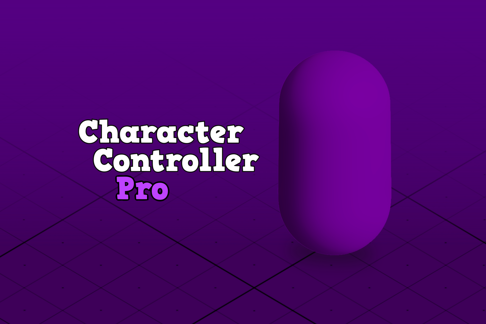

# Introduction

## What is this?

This is a complete guide that explains (hopefully) how the asset works. It has all the information the user needs to know in order to set up, use and/or extend the asset. 

* This document is **NOT** a reference to the code -> Read the API reference.
* This document **DOES NOT** explain what a particular field (from a component) does -> Read the tooltips associated with a particular field.

## How to read this?

This documentation is divided in three parts:

1. **The package** explains how to do the initial setup, use and update the package.
2. **Fundamentals** takes care of those theorical aspects of the asset.
3. **How to** is much more oriented to specific tasks, quick tips and mini tutorials.

## How am i supposed to know what M method does?

This document is **NOT** a reference to the code. For that please read the [API reference](https://lightbug14.github.io/lightbug-web/character-controller-pro/Documentation/html/index.html).

## How am i supposed to know what F field means?

This document **DOES NOT** explain what a particular field (from a component) does. If you want to know more please read the [tooltips](https://docs.unity3d.com/ScriptReference/TooltipAttribute.html) associated with a particular field.

## Is this documentation old?

Not at all, this is the official latest version of the docs. This means that it is updated almost in sync with the latest version of the package (indicated in the site name at the top left).

## I have an older version of CCP, Am I doomed?

I always recommend to **get the latest version of Character Controller Pro.** That said, don't worry, in general most of the concepts will remain almost the same. Once you understand the basics of the asset, you are good to go (and probably never return to this place).

## Is there an easy way to get started?

Check the "How to..." section of this documentation.

There is no correct way of creating a character, it all depends on the type of character you want to create (animated or not, humanoid or generic, static, 2D or 3D, etc.). The "How to..." section will guide you on how to build the character you want bit by bit. Consider this section as a modular "get started" tutorial.
