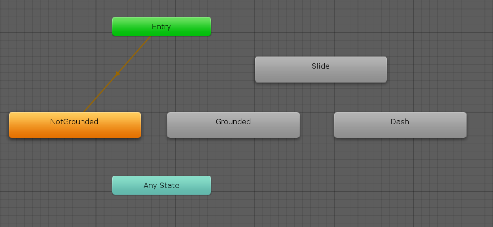
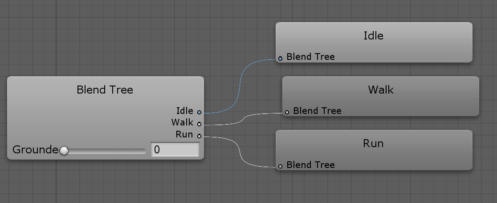

# Character animation

A simple animation component that triggers animation clips based on the _CharacterActor_ state. It's compatible with the _Animator_ controller, but it can be extended to other systems \(for example the Legacy'' animation system\) by deriving from this component class.

This component is probably the one that you will want to fully customize, since there is not a correct animation scheme for the job. The package might include more tools in the future.

## Blend trees

Blend trees allow us to blend between animation clips, simple as that. This is used in this implementation in two cases. The first one is when the character grounded and stable. The second one is when the character is not grounded.

If you open the Animator controller included in the package, you will see something like this:

_NotGrounded_ and _Grounded_ are blend trees, the rest are simple _Animator_ states.

A blend tree reads a specific variable to decide which clip of the tree it should play. This variable is fed to the blend tree by the _CharacterAnimation_ component. Its name can be modified in the inspector.

For instance, in the _Grounded_ blend tree the variable passed through is the current velocity magnitude. 

We can see there are three clips in it: _Idle_, _Walk_ and _Run_. The result will depend on the variable value, and the chosen threshold values as well.

## IK foot placement

Although the character included with the package is not perfectly suited to work with IK foot placement \(due to its proportions and the fact that it wasn't design for this task very well\), the _CharacterAnimation_ component offers some basic functionality in this regard.


To make a character work with IK you'll need to:

1. Import an animated model using the _Humanoid_ rig.
2. Configure its avatar \(choose the left and right foot\)
3. Configure the weight curves in the animated model \(1 is full weight, 0 is no weight\). Make sure the curves names match with the weight curves names from the _CharacterAnimation_ component
4. Activate the _IK pass_ in the Animator layer settings.
5. Activate the _IK Foot Placement_ toggle in the _CharacterAnimation_ component.


The IK function will cast a sphere towards the ground \(for each foot\) to determine where the foot needs to be placed at. It will also take into account the rotation as well, so the foot will be correctly rotated using the hit normal.

