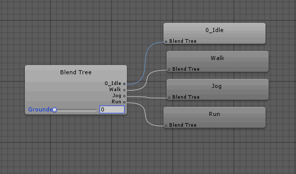

# Character animation

This component is responsible for triggering animation clips, based on the current _CharacterActor_ state. It was designed to be compatible with the _Animator_ controller, although it can be extended to other systems \(for example the Legacy'' animation system\) by deriving from this component class.

This component is probably the one that you will want to fully customize, since there is not a correct animation scheme for the job. The package might include more tools in the future regarding animation.

## The Animator controller

The _Demo character_ animator controller included in the package represents sort of a template to work with. This is how it looks:

There are a few things to consider in order to "communicate" properly with the animator, these are variables, transitions and blend trees.

## Variables

The _Animator_ variables serve as the main interface between the scripts and the _Animator_ functionalities \(blends, transitions, etc.\). These are the variables defined by default:

These variables are floats and triggers, the reason for this is because the script uses three particular features of the _Animator_ component: _**transitions**_, _**blend trees**_, and _**animation curves**_.

## Transitions

The _CharacterAnimation_ allows you to change from one state to another through transitions. These change of state can be configured using two modes \(_Animator play modes_\):

<table>
  <thead>
    <tr>
      <th style="text-align:left"></th>
      <th style="text-align:left"></th>
    </tr>
  </thead>
  <tbody>
    <tr>
      <td style="text-align:left">Trigger</td>
      <td style="text-align:left">
        
The <em>CharacterAnimator</em> component will use the triggers variables
          to change the current state.

        

        
<em>This mode will produce smoother results, since the transitions can be configured using any transition duration.</em>
        

      </td>
    </tr>
    <tr>
      <td style="text-align:left">PlayState</td>
      <td style="text-align:left">
        
The <em>CharacterAnimator</em> component will play directly the state using
          the Animator.Play method.

        

        
<em>This mode will produce instant transitions, this is because the state is instantly reached (transition duration = 0).</em>
        

      </td>
    </tr>
  </tbody>
</table>
In order to switch between these two modes **the transitions and the states names must match**. For example, see how the name "Grounded" is used for the grounded state and the trigger responsible for the transition to this state.


## Blend trees

Blend trees allow us to blend between animation clips, simple as that. These blend trees are used to define a mode detailed animation state. For more information check [this](https://docs.unity3d.com/Manual/class-BlendTree.html) link.

_NotGrounded_ and _Grounded_ and _Dash_ are blend trees. _Slide_ is a simple state with a clip \(for now\).

A blend tree needs to read a specific variable to decide which clip of the tree it should play. This variable is fed to the blend tree by the _CharacterAnimation_ component. 

For instance, in the _Grounded_ blend tree the variable passed through is the current linear velocity magnitude. 

We can see there are three clips in it: _Idle_, _Walk_ and _Run_. The result will depend on the variable value, and t

he chosen threshold values as well.The variables names can be defined in the inspector:

## Curves \(IK\)

The curves are used for the IK functionality of the _Animator_, especifically for "IK foot placement". Even though the character included with the package is not perfectly suited to work with IK foot placement \(it is a "generic" character, not a humanoid\), the _CharacterAnimation_ component offers some basic functionality in this regard.


To make a character work with IK you'll need to:

1. Import an animated model using the _Humanoid_ rig.
2. Configure its avatar \(choose the left and right foot\)
3. Configure the weight curves in the animated model \(1 is full weight, 0 is no weight\). **Make sure the curves names match with the weight curves names from the** _**CharacterAnimation**_ **component**.
4. Activate the _IK pass_ in the Animator layer settings.
5. Activate the _IK Foot Placement_ toggle in the _CharacterAnimation_ component.


The IK function will cast a sphere towards the ground \(for each foot\) to determine where the foot needs to be placed at. It will also take into account the rotation as well, so the foot will be correctly rotated using the hit normal.

The _Animator_ will automatically read the animator curves from the animation \(in this case _**IK\_LeftFoot**_ **and** _**IK\_RightFoot**_ **by default**\) and assign their current values to each one.

