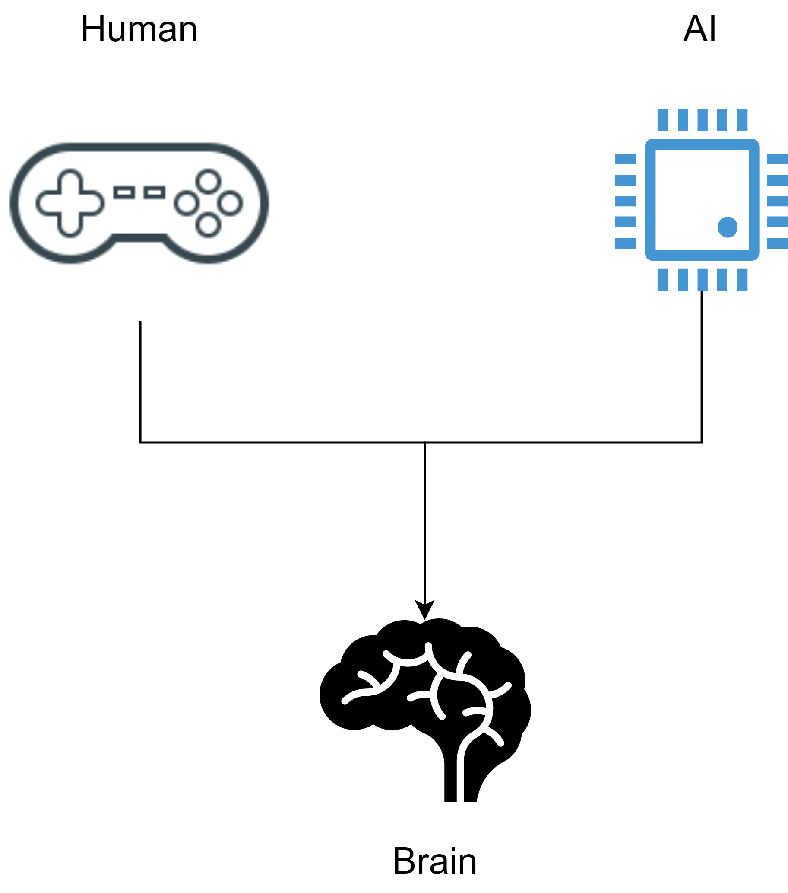
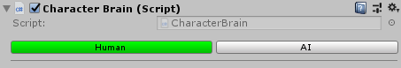
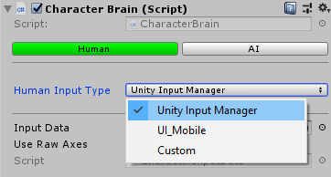

# Character brain

The character brain is a component responsible to handle all the character actions. These actions can be triggered either from a human player or the AI.

All the available actions are predefined in a structure and updated by the _CharacterBrain_ component at runtime. This approach create a level of abstraction between the inputs \(GetKey, GetButton, etc.\) and the character actions themselves \(jump, move forward, etc.\).



To select one mode or the other simply click on the buttons in the inspector. It should look like this:



## Actions

An action is just a struct that mimics an input source. This source can be a button, an axis or axes.

|  |  |
| :--- | :--- |
| ButtonAction | A toggle, this action can be pressed, held or released. |
| AxisAction | A 1D Value from -1 to 1 \(similar to `GetAxis`from Unity\) |
| AxesCompositeAction | A 2D Value from, basically a combination of two axis. |


Advantage: We can update these actions as we want, by reading inputs from a device \(Human\) or simply by making them up \(AI\).


These actions are predefined and grouped together inside a struct. Each one represents a particular input.

```csharp
public struct CharacterActionsInfo
{
    public AxesCompositeAction inputAxes;
    public ButtonAction run;  
    public ButtonAction jump;  
    public ButtonAction crouch;  
    public ButtonAction dash;  
    public ButtonAction jetPack;
    
    //...
    
}
```


if you need to add or remove actions please make a backup.


The character brain component contains a copy of this struct:

```csharp
CharacterActionsInfo characterActions = new CharacterActionsInfo();
```

All the actions will be updated in the Update cycle. The process will vary depending on the brain type selected. 

```csharp
void Update()
{
    if( isAI )
        UpdateAIBrain();
    else
        UpdateHumanBrain();	
}
```

 

### Reading the character actions

By default a _CharacterState_ has a _CharacterBrain_ property, which gets the _CharacterBrain_ component asotiated with the character. We can read the actions values anytime we want. For example, we can read if the jump button was pressed down by doing:

```csharp
bool wasPressed = CharacterBrain.CharacterActions.jump.isPressed;
```

 Or we can get the inputAxes value:

```csharp
Vector2 inputAxes = CharacterBrain.CharacterActions.inputAxes.axesValue;
```


Notice that these actions are not necessarily Human actions, that is, they are not linked to input devices whatsoever. The AI can produce the same type of actions as the human, so, the state is totally agnostic of the actions source.

For more information please read the [Character brain](character-brain.md) section.


\_\_

## Brain types

### Human brain

Basically in a human brain the actions are updated using input devices \(keyboard, mouse, joystick, UI, etc\). Regardless of the input detection method used, all the actions must be previously defined using an _input data asset_ \(a ScriptableObject\).

In order to update these actions an _input handler_ is needed. This is a simple abstract component that needs to the implemented in order to process inputs. It has the most common input functionalities, such as _GetButton_, _GetButtonDown_, _GetButtonUp_ and _GetAxis_. Each input handler should implement these methods in its own way.

The package contains two default input handler components, one for the classic _Unity's Input Manager_ and another for the _Unity's UI_ system \(used in mobile games\). 

Additionally there is support for a custom input handler \("Custom"\). This useful if you want to create your own handler.

These modes can be selected in the brain using the _Human Input Type_ field.



|  |  |
| :--- | :--- |
| Unity Input Manager | This input handler reads inputs from the Unity's Input manager. Make sure the actions names \(input data\) and the axes from the input manager match exactly. |
| UI\_Mobile | This input handler reads all the mobile inputs components in the scene. This components are assigned to the UI elements responsible for converting UI Events into input values. |
| Custom | A custom implementation of an input handler. |

### AI brain

In an AI brain the actions are determined by a script, based on the current behaviour type. There are two types of AI behaviours:

|  |  |
| :--- | :--- |
| Sequence behaviour | Set of predefined actions stored as a _ScriptableObject_. Basically this behaviour tries to imitate a human player with scripted actions. The AI character will not be \`\`smart'' in any way. |
| Follow behaviour | This behaviour does a path calculation between the character an a target. **In order to use this behaviour a** _**NavMesh**_ **must be generated previously**. |

## 


