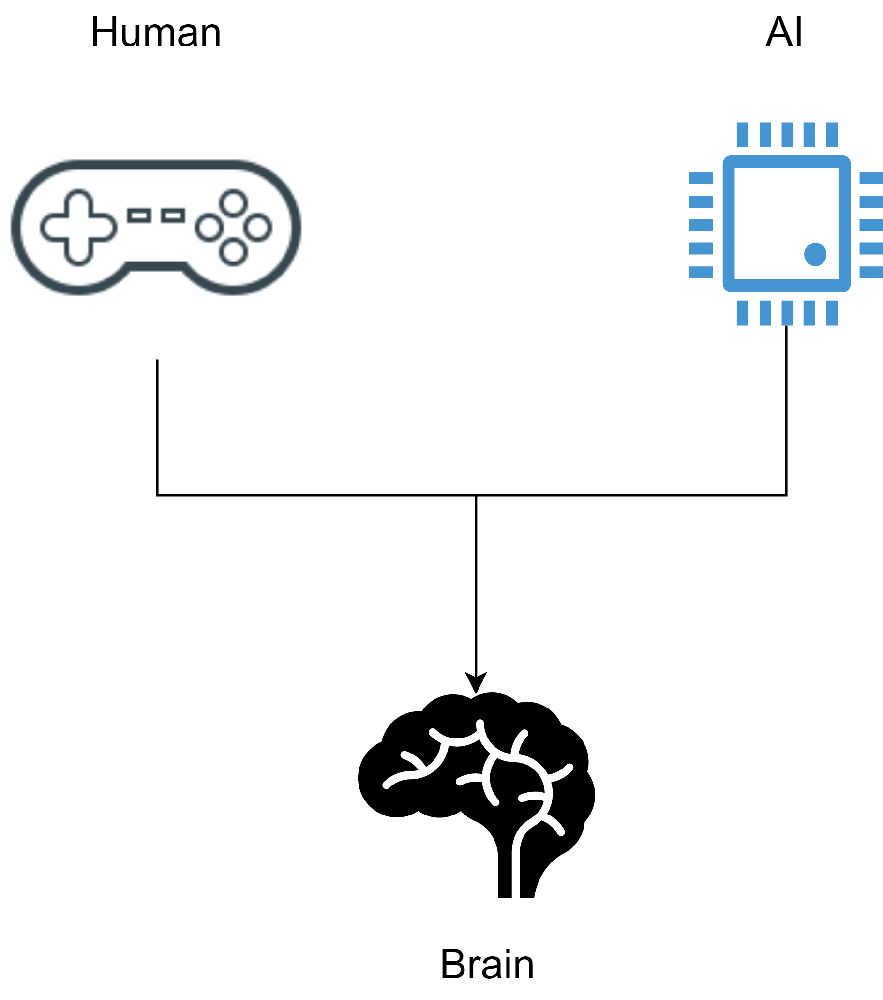
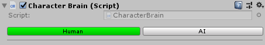
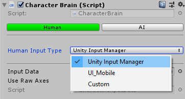

# Character brain


Most of the Brain functionalities are quite similar to the Unity's new input system. You will notice that the names are quite similar, the way to orginize the actions, the asset creation. That's no coincidence, the main goal with this is to delegate all the input related tasks to the new input system (which does this is a better way). The focus will be on the components on top of the system, not the system itself.

So, if you see these components in CCP releases is because the new input system is still not fully capable of doing exactly what CCP does (for now).


The character brain is a component responsible to handle all the character actions. These actions can be triggered either from a human player or the AI.



If you are familiar with the Unity's "new" input system you probably know what an action is. An action is just a link between the input device and the gameplay logic code.

All the available actions are predefined in a structure and updated by the _CharacterBrain_ component at runtime. This approach create a level of abstraction between the inputs (GetKey, GetButton, etc.) and the character actions themselves (jump, move forward, etc.).

## Actions

### Types

CCP's Implementation supports three types of actions

| Action type   | Description                                              |
| ------------- | -------------------------------------------------------- |
| BoolAction    | A toggle, this action can be pressed or not pressed.     |
| FloatAction   | A 1D Value from -1 to 1 (similar to `GetAxis`from Unity) |
| Vector2Action | A 2D Value from, basically a combination of two axis.    |


Note that the BoolAction value is true or false (a bool). If you need to know if that action was "started" or "canceled" (e.g. was the jump button pressed?), you need to get the **Started** or **Canceled** property respectively.


### Character actions

These actions are predefined and grouped together inside a struct. Each one represents a particular input.

```csharp
public struct CharacterActions 
{
	// Bool actions
	public BoolAction @jump;
	public BoolAction @run;
	public BoolAction @interact;
	public BoolAction @jetPack;
	public BoolAction @dash;
	public BoolAction @crouch;
    
  //...
}
```


You can visualize the actions values in runtime in the inspector (Human or AI).


.png>)

### Adding/Removing actions

If you need to add/remove actions from the struct, normally you would need to modify the code itself. This can be somehow annoying sometimes, especially if you miss something along the way.&#x20;

Luckily there is an easy way to achieve the same result, by using a _**CharacterActionsAsset**_. This asset has some lists of actions (bool, float and vector2), you just need to populate those with your personal data. After that's done just click the **Create actions** button and automagically the CharacterActions struct will be updated :slight\_smile: .

.png>)

CCP comes with a **Default Character Actions** asset, just to keep the original data there (you can create your own assets of course).


Have in mind that adding/removing actions might affect the scripts from the Demo content. These scripts are using the default CCP actions.


### Reading actions

By default a _CharacterState_ has a _CharacterBrain_ property, which gets the _CharacterBrain_ component asotiated with the character. We can read the actions values anytime we want. For example, we can read if the jump button was pressed down by doing:

```csharp
bool wasPressed = CharacterActions.jump.Started;
```

&#x20;Or we can get the movement axes (Vector2) value:

```csharp
Vector2 inputAxes = CharacterActions.movement.value;
```


Note that these actions are not necessarily Human actions, that is, they are not linked to input devices whatsoever. The AI can produce the same type of actions as the human, so, the state is totally agnostic of the actions source.



__

## Brain types



### Human brain

Basically in a human brain the actions are updated using input devices (keyboard, mouse, joystick, UI, etc). Regardless of the input detection method used, all the actions must be previously defined using an _input data asset_ (a ScriptableObject).

In order to update these actions an _input handler_ is needed. This is a simple abstract component that needs to the implemented in order to process inputs. It has the most common input functionalities, such as _GetButton_, _GetButtonDown_, _GetButtonUp_ and _GetAxis_. Each input handler should implement these methods in its own way.

The package contains two default input handler components, one for the classic _Unity's Input Manager_ and another for the _Unity's UI_ system (used in mobile games).&#x20;

Additionally there is support for a custom input handler ("Custom"). This useful if you want to create your own handler.

These modes can be selected in the brain using the _Human Input Type_ field.



|                     |                                                                                                                                                                                 |
| ------------------- | ------------------------------------------------------------------------------------------------------------------------------------------------------------------------------- |
| Unity Input Manager | This input handler reads inputs from the Unity's Input manager. Make sure the actions names (input data) and the axes from the input manager match exactly.                     |
| UI\_Mobile          | This input handler reads all the mobile inputs components in the scene. This components are assigned to the UI elements responsible for converting UI Events into input values. |
| Custom              | A custom implementation of an input handler.                                                                                                                                    |

### AI brain

An AI brain defines the actions via script, plain and simple. If you want to change your Human character for an AI character, just click the AI button in the inspector. After that choose an _AIBehaviour_ component for the brain.

#### AI Behaviour

An AI behaviour is just an implementation of a particular AI logic, using a monobehaviour.&#x20;


On previous releases, these AI behaviours were embeded into the brain component (not extensibles at all). Now these components are external Monobehaviours you can easily create and customize


.

.png>)

##

