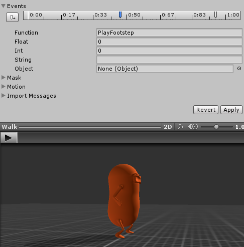

# Character particles

The particles controller founded in the package is responsible for managing and triggering all the particles you see on screen, coming from the character. A particle prefab is specified as the main particle \(its parameters will be modified by the controller\).

All the particles are managed using a _ParticleSystem_ pooler. This is a class that manages the visibility or activation of the objects it contains in a smart way. This is used to avoid the runtime instantiation of the objects \(usually a prefab\), thus improving performance.

These particles are triggered in response to events. There are two types of events that the particles can listen to, animation events and _CharacterActor_ events.

## Footsteps

To show the footsteps particles effects the _CharacterParticles_ component uses **Animation events**. This type of events are defined in the animation import settings. The advantage of using Animation events is that the event position can be set exactly where we want \(see the next image\).



The events requires a F_unction_ field name, this is because the animation system will call this methods for us.


It's super important that the method name and the field _Function_ from the animator settings match exactly. Otherwise the method will not be called at all.


The _CharacterParticles_ component has a public method called PlayFootstep in it. Inside 

```csharp
public void PlatFootstep()
{
        // ...
        particlesPooler.Instantiate( ... );        
}
```

## _OnGroundedStateEnter_  particles

If the character hits the ground it will produces some particles, whose velocity will vary depending on the falling speed at the moment of impact. 

In order to produce this effect a _**CharacterActor**_ **event** was used, this event was the _OnGroundedStateEnter_. When this event is called the local vertical velocity is passed along as a parameter, which is great for this.

The magnitude obtained from the y component of the local vertical velocity is evaluated using a custom _AnimationCurve_ \(horizontal axis\). The output of this curve \(vertical axis\) is used as the "start speed" of the _ParticleSystem_ triggered.

