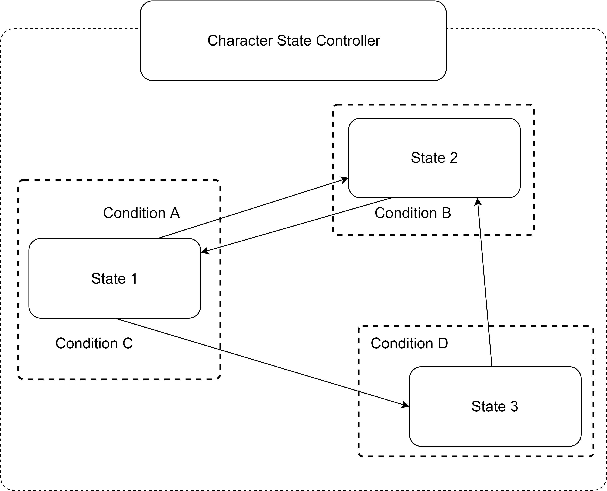
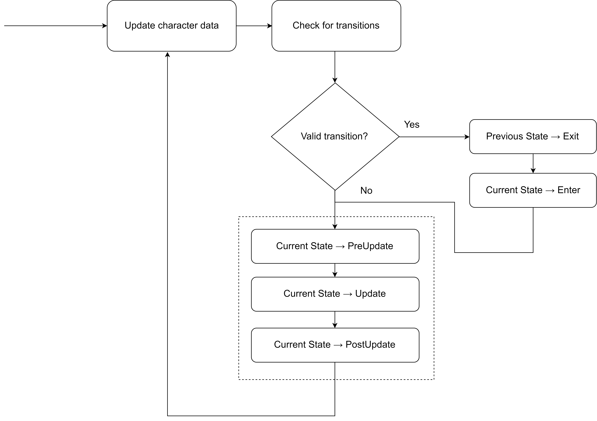
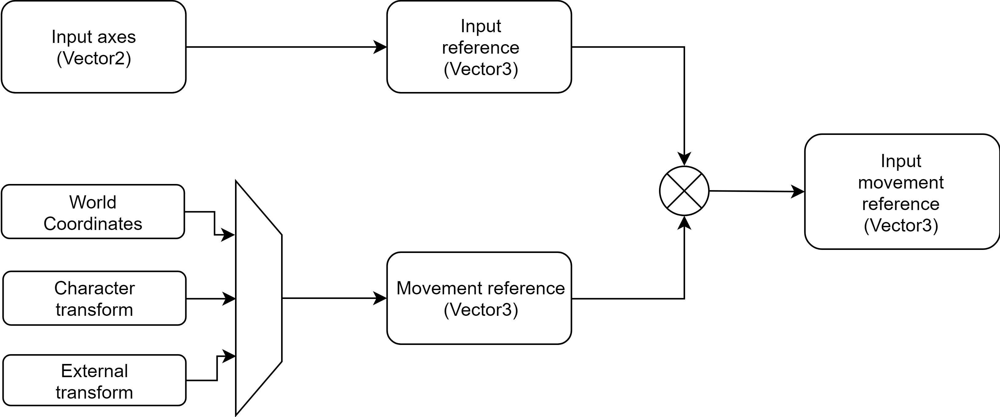
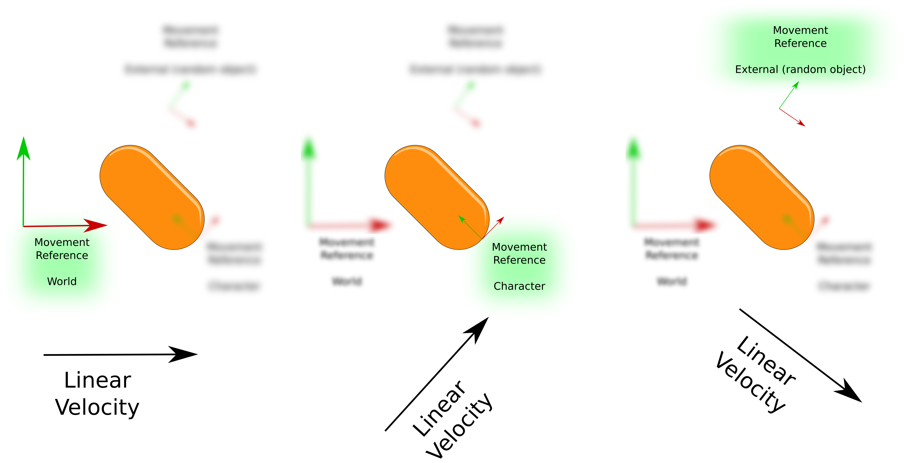

# Character state controller

The _CharacterStateController_ is the main component of the _Implementation_. Basically this is the main interface to the _CharacterActor_ component.

As the name implies, this component is responsible for control all the important aspects of the states. There are a few things that can happen inside a state logic, such as action detection \(from a input device or an AI behaviour\), material interaction, movement, rotation, and so on. So, it is important to handle all these aspects in an orderly manner.

Apart from handling the state logic, this component also hold all the important data the states are going to share between each other.

## Finite State Machine

This component implements a "Finite State Machine" \(FSM\). This machine is responsible for managing and executing all the valid states of the character and the transitions between them.

A simple and crude representation of the structure of a state machine is shown in the next image:

The main loop cycle of the _CharacterStateController_ component is shown in the next figure:

## Movement direction

The _CharacterStateController_ component include a simple property that can be used by the states to obtain a movement direction vector, based on the current input and a "reference". This direction is called _input movement reference_.

The _input movement reference_ calculation is expressed in the next block diagram:


This vector is just the result of super basic algebra between input data and a transform component. All the information needed to create it can be obtained from inside the state. So, it's ok if you don't want to use it for your own state logic, just know that it is there.


### Input reference

The input reference is a vector created exclusively by input actions \(AI or Human\), in this case by the _input axes_ information. By default the _input axes_ are defined as a _Vector2_ that contains the _Horizontal_ and _Vertical_ axes values.

$$ inputReference = < inputAxes.x , 0 , inputAxes.y > $$

Basically what this does is to map the input data into 3D space.

### Movement reference

A _movement reference_ is defined as a set of orthonormal vectors \(think of the typical _right, up and forward_ vectors set\).

There are three types of references available:

|  |  |
| :--- | :--- |
| World  | The reference uses the world coordinates, this means that the _right_, _up_ and _forward_ directions are equals to `Vector3.right`, `Vector3.up` and `Vector3.forward` respectively. |
| Character  | The reference uses the own character transform \(`transform.right`, `transform.up` and `transform.forward`\) to update its components. |
| External  | The reference uses an external transform to update its components. |

### Input movement reference

By multiplying the **input reference** with the **movement reference** it is possible to create sort of a mix between inputs and movement reference, hence the name. To better clarify this concept see the next example figure:

There are three cases: World, Character and external, in which the same input axes vector \(in this case the "right" action\) is applied to each one of them. The figure shows three very different results, depending on the movement reference used.

Once the _InputMovementReference_ vector has been defined, it only remains to multiply it by the speed required.


The _InputMovementReference_ vector is updated before the states main loop. All the character states can have access to this vector, and perform its own calculations to determine the velocity.


## Materials

A material consists of pure data \(_ScriptableObjects_ in this case\) that contains properties for different materials. These materials are defined in the context of the _CharacterStateController_, shareable by all the states.

These materials can be used to affect the resulting character movement. The type of material affecting the character will depend on the grounded state, the material properties, and finally the movement properties of the character state.

For instance, in the _NormalMovement_ state, the material parameters are used to modify the velocity sent to the _CharacterActor_.

A material can be a **volume** or a **surface**:

|  |  |
| :--- | :--- |
| Volume | All the space around the character \(not grounded parameters\). This space can be made of air, water, jelly, and so on. |
| Surface | A solid on which the character can stand on \(grounded parameters\). A surface can be ice, mud, grass, etc. |

There are parameters that can be configured for both volumes and surfaces. These parameters are related to the amount of grounded control, not grounded control, gravity and speed modifiers.

### Default materials

Any material without a proper tag on it will be considered as a \`\`default material''.

### Tagged materials

A material element can be defined by using a _tag_. Then, it can be configured in the scriptable object.

## 

