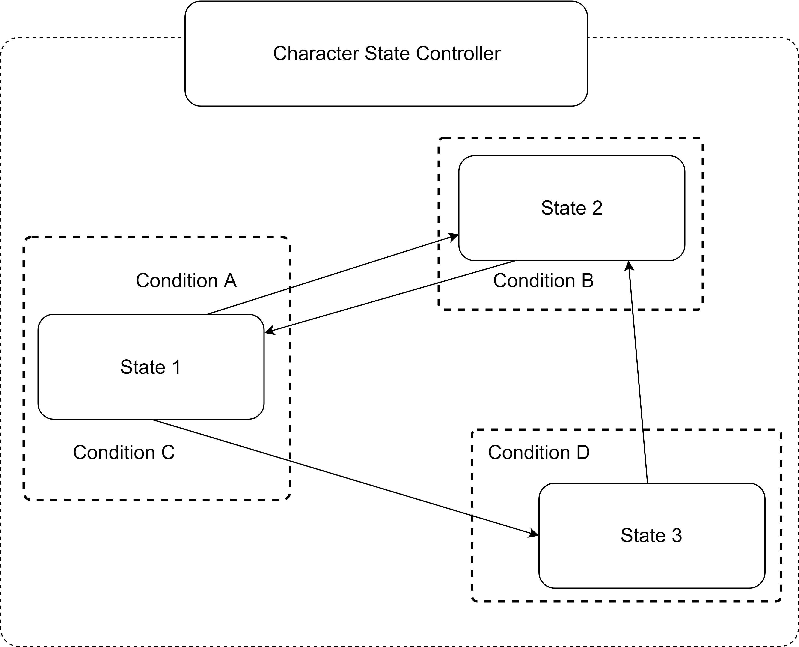
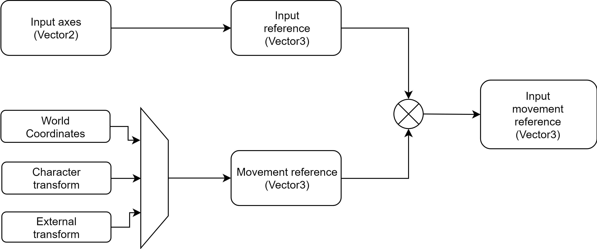
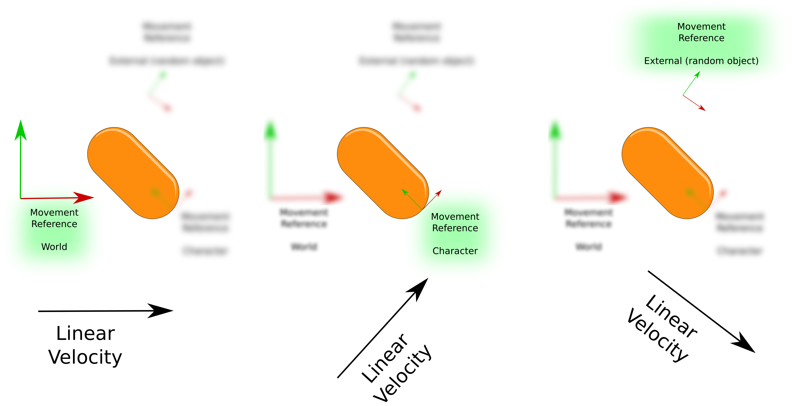

# Character state controller

This component is essentially a "character-oriented" finite state machine (FSM) that also includes some other useful functionalities that will help you handle animation, actions and movement. This component can be considered as a "high level character controller".

## Finite State Machine

This component implements a "Finite State Machine" (FSM). This machine is responsible for managing and executing all the valid states of the character and computing the transitions between them.

A simple and crude representation of the structure of a state machine is shown in the next image:

The main loop cycle of the _CharacterStateController_ component (simplified version) is shown in the next figure:

## Movement direction

Input signals by their own do not translate into gameplay, often they need to be converted into 3D world space (a vector) in order to be processed or sent to another component. For instance, if we want to move out character using the WASD keys, we want to convert that input action (Vector2 in this case) into a velocity value (Vector3). This is what the input movement reference does.


This vector is just the result of super basic algebra between input data and a transform component. All the information needed to create it can be obtained from inside the state. So, **it's ok if you don't want to use it for your own state logic**, just know that it is there.


The input movement reference is just the combination of two concepts, **input reference** and **movement reference**.

### Input reference

The input reference is a vector created exclusively by input actions (AI or Human), in this case by the _input axes_ information. By default the _input axes_ are defined as a _Vector2_ that contains the _Horizontal_ and _Vertical_ axes values.

$$inputReference = < inputAxes.x , 0 , inputAxes.y >$$

Basically what this does is **mapping the input data into 3D space**.

### Movement reference

A _movement reference_ is defined as a set of orthonormal vectors (think of the typical _right, up and forward_ vectors set) that are built based on a given reference. There are three types of references available:

| Reference Type | Description                                                                                                                                                                          |
| -------------- | ------------------------------------------------------------------------------------------------------------------------------------------------------------------------------------ |
| World          | The reference uses the world coordinates, this means that the _right_, _up_ and _forward_ directions are equals to `Vector3.right`, `Vector3.up` and `Vector3.forward` respectively. |
| Character      | The reference uses the own character transform (`transform.right`, `transform.up` and `transform.forward`) to update its components.                                                 |
| External       | The reference uses an external transform to update its components.                                                                                                                   |

### Input movement reference

By multiplying the **input reference** with the **movement reference** it is possible to create sort of a mix between inputs and movement, hence the name.&#x20;

To better clarify this concept see the figure. There are three cases: World, Character and external, in which **the same input axes vector (in this case the "right" action) is applied to each one of them**. The figure shows three very different results, depending on the movement reference used:

## Animation

### Runtime animator controller

By default the runtime animator controller used will be the one from the Animator component itself. This means that one big controller will need to contain all the animation state machine for all your states. if this doesn't sound too good for you, there is one alternative that might help.

Mecanim (the system behind the Animator controller logic) can be really good and intuitive for some tasks, especially if you are not a coder, but sometimes can be a living nightmare :face\_with\_symbols\_over\_mouth:. CCP implements a **multi-controller** approach, this means that each state component is capable of overriding the Animator runtime controller.

.png>)


If you don't like this approach you can totally ignore it. This approach is 100% optional.


