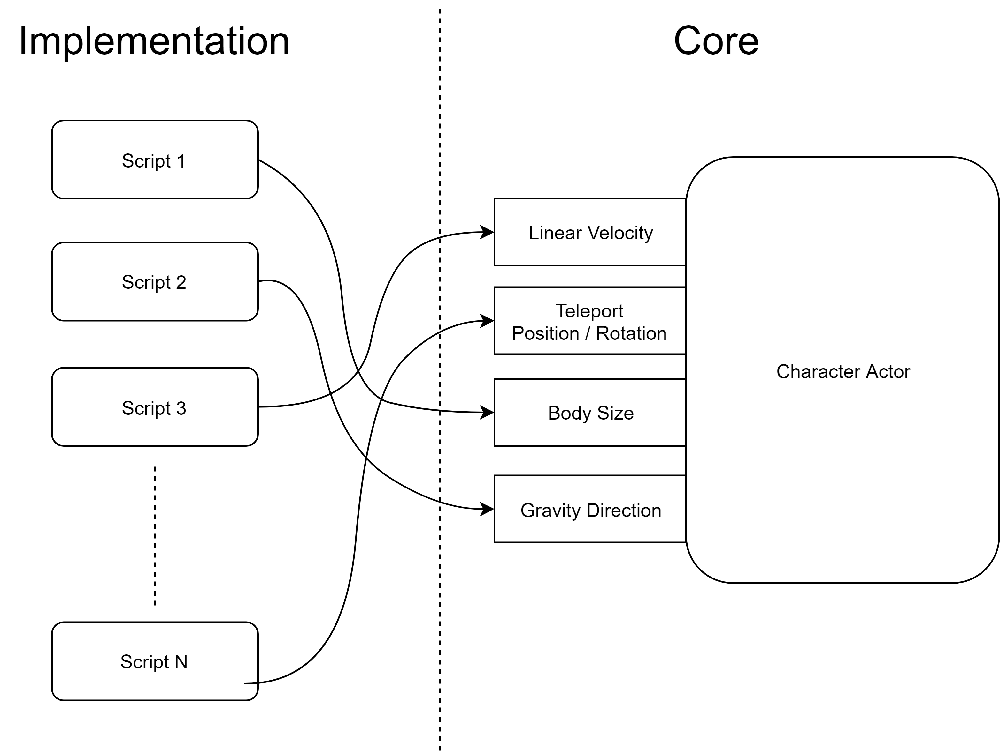

# Untitled

The _Implementation_ consist of set of scripts that implement and use the functionalities of the _Core_. Basically starting from a low level concept \(the core\) to a high level concept \(a character system with game components\).

This part of the package contains some components that will help you right away, handling movement, environment settings, animation, particles, moving/rotating platforms, camera controllers, AI behaviours, and so on. The main goal of this part is to define rules for character, starting from a low level concept \(the core\) to a high level concept \(a character system with game components\).

This implementation can me modified to fit a particular game style \(for example an RTS game, a 2D platformer, a top-down shooter, etc.\). It has been created as a general purpose implementation.

