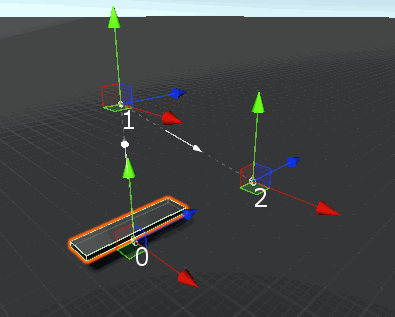
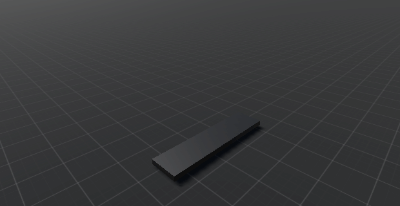
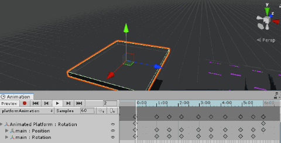

# Kinematic actors

Just like character actors, a kinematic actor is another fundamental part of the scene. These objects can be **platforms** or **cameras**.

## Kinematic platforms

The package includes components that allow to script the movement/rotation of a platform in a particular way \(depending on the component\).

All the moving/rotating platforms components are child classes from the _KinematicPlatform_ class. Currently there are two types of kinematic platforms:

### Node based platform

These platforms movement and rotation are purely based on nodes. Use this component to create platforms that moves and rotate precisely following a predefined path.

### Action Based platform

These platforms movement and rotation are defined by a single action. Use this component if you want to create platforms with a pendulous nature, or infinite duration actions \(for instance, if the platform should rotate forever\).

### Externally controlled platform

The _KinematicPlatform_ component is not an abstract component, this basically means that can be assigned to a gameObject, just like any other component. If you assign

These platforms are completely handled by an external component, the most common case is the animation clip \(using the Animate Physics mode\).\ }

## Kinematic cameras

A kinematic camera is just a classic camera \(using the \textit{Camera} component\) that's being moved and rotated by the physics engine \(\textit{Rigidbody} or \textit{Rigidbody2D} component\).

This implementation comes with two kinematic cameras, a \textit{KinematicCamera2D} and a \textit{KinematicCamera3D}.

### Kinematic Camera 2D

This camera behaves like a classic 2D platformer camera. Basically it moves along the XY plane following a character. The camera 2D:

* Works fine with any orientation.
* Can do interpolated movement \(position and rotation\).
* Moves based on predefined AABB bounds \(Axis Aligned Bounding Box\). Only if the character goes beyond this bounds the camera will start moving.
* Moves based on a single reference point.
* Look ahead, predicting the horizontal and vertical movement.

### Kinematic Camera 3D

This camera behaves like a classic third person camera. Basically it orbits around a character. It can:

* Do yaw motion \(it can be disabled\).
* Do pitch motion \(it can be disabled\).
* Zoom in and out using the mouse scroll wheel.
* Detect any geometry as an obstacle \(via LayerMask\).
* Works fine with any orientation.
* Do interpolated movement \(position and rotation\).

