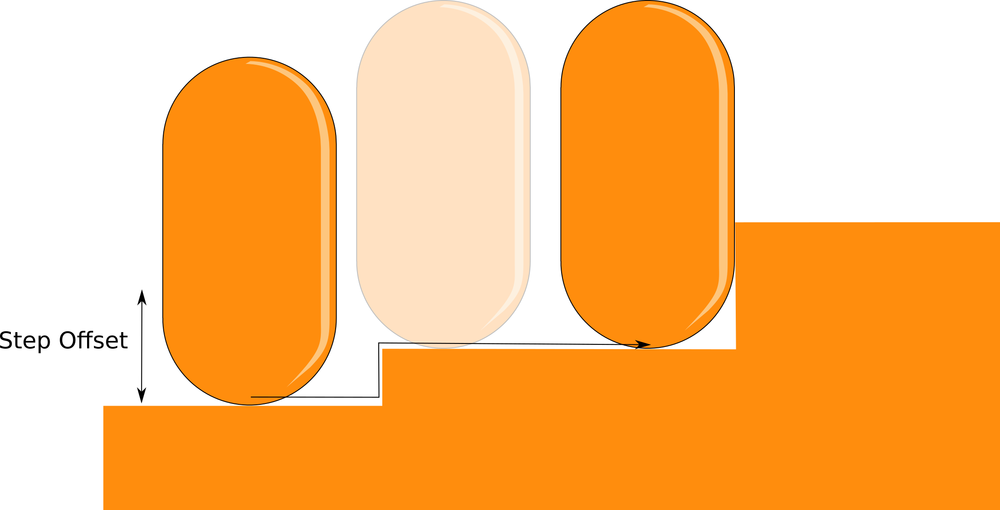
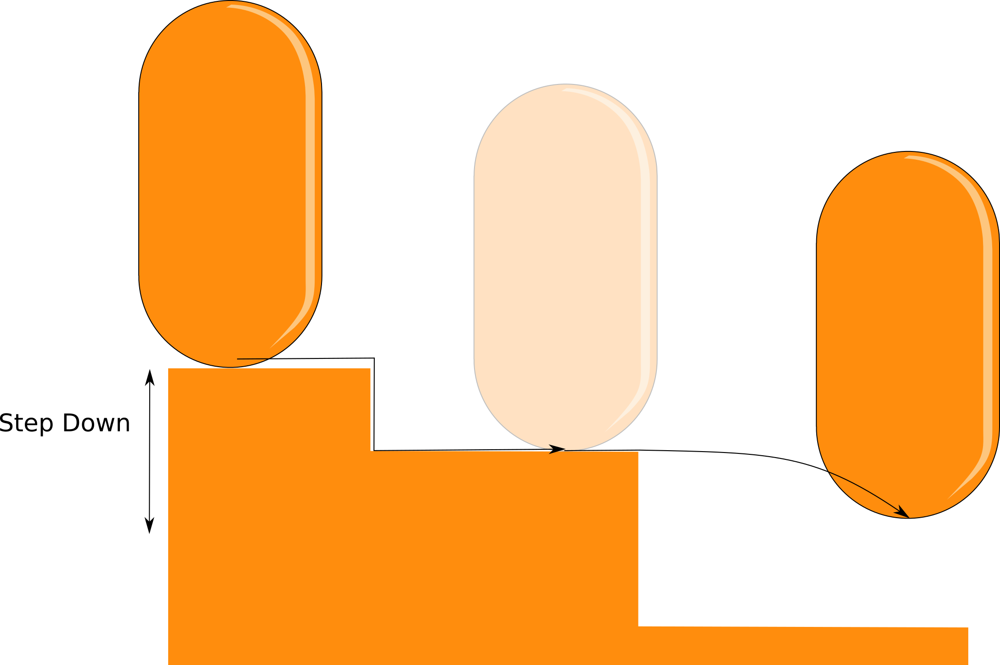
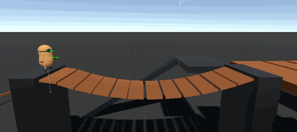

# Character actor

The _CharacterActor_ component can be also referred as a Character-oriented rigidbody. Most of the time you will be changing the position, the rotation and/or the velocity of the **RigidbodyComponent** component \(see the API reference for more detail\).

The job of the CharacterActor is to **ensure that all the changes are being applied correctly \(**based on a set of predefined "rules"\).


The character **does not represent a "vainilla" dynamic rigidbody**. Even though it uses most of the rigidbodies physics and tools, there are some properties whose values cannot be modified.


## Character Actor Behaviour

This component defines the logic of the character. Before the actor do its magic, the character actor behaviour is updated \(following the FixedUpdate\). **Without a behaviour the character is useless.**


The entire [implementation ](../implementation/)of the asset is derived from this behaviour. See the next section for more details.


## Size

Internally the size of the character is stored in a Vector2 variable called _bodySize_. The x component represents the width and the y component represents the height. The initial size will be assigned based on the capsule collider parameters and some internal constants.

The size can be set externally by a script, by passing any possible value as the desired size. Since the character may or may not fit in a given space, the size is internally checked beforehand by the _CharacterActor_. If the test is valid, then the size is modified.

## Position

The position of the character \(rigidbody component\) can be changed instantly at any time. 

Additionally, you can "teleport" the character to a new destination as well. **What's the difference?** The teleport process will also trigger the OnTeleport event.

Needless to say that teleportation of any kind does not take into account colliison detection. If you need to move the character in a realistic way, you need to change its velocity.

## Rotation

The rotation of the character is a very delicated and tricky topic. It is handled in a very specific way, depending on the physics involved, and the vertical alignment direction. 

### Physics

#### 3D

For a 3D character, the rotation can be anything, you are free to set the value you want. The returned value \(a Quaternion\) will represent the character rotation. 


In previous versions \(1.0.x\) the character yaw rotation was fixed.


#### 2D

For a 2D character, the forward direction **need to be facing towards Vector3.forward or Vector3.back \(a.k.a - Vector3.forward\)**. Otherwise, the collider 2D area will be less than the original intended area.


You can test this by yourself, create a CapsuleCollider2D and rotate it along the y axis.


This is of course unacceptable. However, you don't need not to worry about this issue, you can assign the rotation value \(Quaternion\) that you want, and the _CharacterActor_ component will be smart enough to make sure everything works nicely.

### Vertical alignment

This feature just modifies the character up direction, based on the current vertical alignment direction.


You can disable this vertical alignment feature in the inspector.



Example: Planet gravity

If you use the _gravityCenter_ field from the vertical alignment feature, you can ensure the up direction of the character will always be - gravity \(see the image below\).

 



## Velocity

The actor is responsible for modifying its current velocity \(from the rigidbody\), in order to move the character properly \(grounded or not, stable or unstable\).

The necessary displacement is calculated based on the current velocity value.

```csharp
CharacterActor.Velocity = someValue;
```

The movement algorithm is based on the classic _Collide & Slide_ algorithm. Although is not necessary to do a bunch of collision test in order to prevent the character to pass through other colliders \(since this is a rigidbody based character controller\), these test are still performed anyway. This is because the character gathers information from the environment and also can predict its movement before hand, which is really useful.

### Grounded state

The movement can be classified in _Grounded_ and _Not Grounded_, depending on the current grounded state. Both have its differences:

_**Grounded**_ **to** _**Not Grounded**_ ****A character will leave the grounded state if the grounding test is negative, or if it is forced to leave that state \(ForceNotGrounded method\).

```csharp
CharacterActor.ForceNotGrounded();
```

If you are using gravity in your script remember to apply a positive vertical velocity \(towards the character up vector\), otherwise the character will return to the grounded state the next frame.

_**Not Grounded**_ **to** _**Grounded**_ ****In this case, you must apply a negative vertical velocity \(towards the character up vector\). If the collision test is valid \(detects a valid ground\) then the state becomes grounded.

### Stability

A character is stable when it is grounded and the _stable slope angle_ \(see the API reference\) is less than or equal to the _slope limit_ value.

```csharp
stable = IsGrounded && ( stableSlopeAngle <= slopeLimit ); 
```

This angle should not be confused with the _slope contact angle_, obtained directly from the collision test \(See the image below, green means stable, red means unstable\).


The concept of stability is very important for the _CharacterActor_ component \(for detecting steps, edges, do ground probing, and so on\). By itself it will not produce any type of movement, but it can be used for creating custom movement logic. 

### Velocity Projection

The _Velocity_ vector provides the information needed to move the character from point A to point B. However, this vector is not used directly to calculate the actual displacement, since it may not follow the _CharacterActor_ internal movement rules. This can be a problem only when the character is grounded.



**Important:** The displacement vector is projected onto the ground plane keeping its initial magnitude. This basically means that the character will always move at its initial velocity magnitude, regardless of the slope angle.


### Slopes handling

The character can walk onto any stable slope. Prior to the movement calculation, a displacement vector is created \(based on the velocity\) and subsequently modified in the process.

If the encountered slope is allowed the character will walk onto it, modifying the displacement vector. if not, the slope will be considered as an invisible wall.


  

### Ground probing

This stage is responsible for putting the character on the ground \(if there is one\). There are two important values to consider:

* **Step offset:** Any stable surface below this height will be walkable by the character.
* **Step down:** When losing contact with the ground, if the distance between the character and the ground is less or equal to this value, then the character will be automatically _grounded._ If there is no ground at all, then the character will be _not grounded_.





#### Edge Compensation

Normally, when a character is standing on an edge it collision shape will make contact with it.


Sometimes detecting the ground using a box shape can be the best option, especially for platform games. The character actor includes an _edge compensation_ feature, simulating a box shape for ground detection in edges.


This feature works only on edges, for slopes you will get the same results as before \(with edge compensation disabled\).


The _edge compensation_ feature brings the advantages of a box \(on edges\) and a capsule \(for slopes\).

#### Dynamic Ground

If the character is standing on a valid dynamic ground, and this object is moved and/or rotated, the character will move and/or rotate along with it \(always following its own orientation rules\). This is shown in next figure \(see how the character maintains its rotation while it moves with the platform\).


## Collision information

A very import aspect of every character controller is the information this provides to the user. This information is really important to set your basic movement rules, like for example detect if the character is grounded or not, use the ground normal, gather the current ground information, etc.

CCP offers this information in form of public properties. In order to access them you need a reference to the _CharacterActor_ component and you are good to go.

For more information about the collision information see the API reference.

## Collision events

A collision event is just a delegate event that is called whenever a particular situation happened \(in this case related exclusively to collisions\). When a specific condition is met, the related event will be called by the _CharacterActor_, therefore calling any method subscribed to it.

The package include a number of collision events, if you want to look at them please refer to the API reference. All the events names start with the word "On" \(normal convention\).


If you want to see all these events in action, or simply see a code example please check the `CharacterDebug.cs`script. It contains a few methods subscribed to all of the available events. You will notice that every delegate event has its own signature, this is because they are passing information along when the event is called.


## Rigidbodies interaction

### External velocity

The _CharacterActor_ does read and modify the rigidbody velocity \(among other things\) in order to produce its results. This can be an issue, especially if we aren't setting the velocity value frame by frame \(e.g. a force/acceleration\). So, every internal "adjustment" need to be ignored after the simulation.

In summary, after the physics simulation is done, the velocity will be like it was before the simulation. 

```csharp
Velocity = preSimulationVelocity;
```

This leads to another interesting result, which is the lack of interaction between rigidbodies and the character \(due to the physics simulation\). Luckily there is a way to add any **external velocity** \(that comes from the physics simulation\) to the character. **Activate the add external velocity bool in the inspector.**

```csharp
Velocity = preSimulationVelocity + externalVelocity;
```

If you want to have full control, customizing the interactions exactly as you want , you can use the contact information \(from the character\) and modify the velocity.

### Push

The character can push other dynamic rigidbodies by colliding with them. The resulting movement will be determine by the interaction and the rigidbodies parameters \(relative velocity, mass, drag, etc\). 


The character will push more easily lighter rigidbodies than heavier ones. 


Since the velocity of the rigidbody is managed by scripts, in order to increase \(or decrease\) the push force you need to increase \(or decrease\) the character **rigidbody mass**. Just like in real life, when you collide with some object it will be moved depending on both its mass and your own mass.


It is important to assign the corresponding rigidbodies layers to the Dynamic LayerMask \(tags and layers asset\) in order to allow proper interactions. Otherwise the rigidbody will be treated as a wall \(infinite mass\).


### Weight

If the character is standing over a dynamic rigidbody this will automatically \(if enabled\) apply a force to it at the contact point, proportional to the rigidbody mass.




