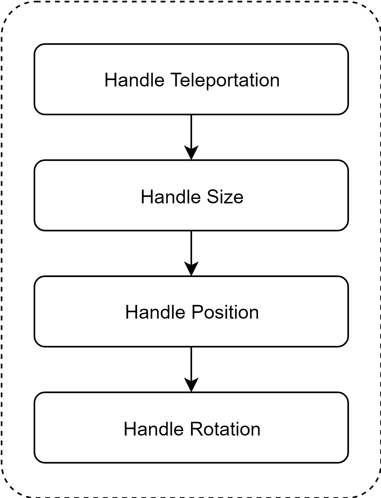
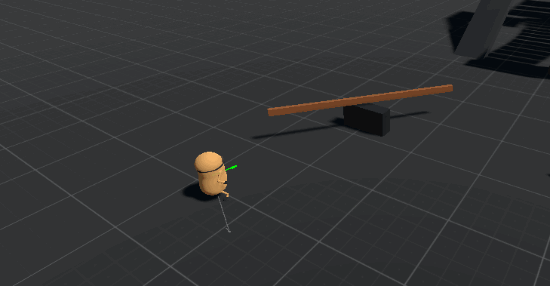

# Character actor

The _CharacterActor_ component follows a few simple rules that needs to be understood in order to use it. These rules are related to teleportation, size, position and rotation. All the actions required from the _CharacterActor_ have a deferred nature, this means that they are not executed immediately. All the changes are applied when the _CharacterActor_ needs to.



The main properties to look for are shown in the next image. The _CharacterActor_ offers a few public methods and properties that allow you to define these properties.


The following sections explain how all these individual elements work internally.

## Teleportation

If the character needs to change instantly its position and/or rotation \(ignoring the collision detection algorithm\) then the Teleportation method should be used.

## Size

Internally the size of the character is stored in a Vector2 variable called _bodySize_. The x component represents the width and the y component represents the height. The initial size will be assigned based on the capsule collider parameters and some internal constants.

The size can be set externally by a script, by passing any possible value as the desired size. Since the character may or may not fit in a given space, the size must be internally checked beforehand by the _CharacterActor_, thus defining the final character size.

## Orientation

The orientation is completely managed by the _CharacterActor_ component. Any external change to the character rotation will be overwritten. There are two ways to describe a normal character rotation:

|  |  |
| :--- | :--- |
| Gravity  | The current gravity direction will define the character up vector as its opposite. |
| Yaw  | This is the rotation motion around the local _up_ axis |

The character is capable of changing its rotation values by using the gravity information. This is possible by using the gravity direction and graviy modes from the CharacterActor component. For example, in figure \ref{fig:gravity} the character is align itself using the gravity vector.


On the other hand, **the character cannot do yaw rotation at all**, instead it has a _forward direction_ vector, which can be defined and used for the user at will. This vector will be properly rotated internally by the _CharacterActor_ \(gravity shifting scenarios and dynamic ground motion\).


It is important to mention that **the forward direction vector will always be projected onto the plane formed by the character up direction**. If a random vector is defined as forward direction, this will be projected onto this plane.

## Position

The change in position related to a _LinearVelocity_ field. The necessary displacement is calculated based on the current linear velocity value. This movement will take into account collision detection. The _LinearVelocity_ vector needs to be set externally by a script.

The movement algorithm is based on the classic _Collide & Slide_ algorithm. Although is not necessary to do a bunch of collision test in order to prevent the character to pass through other colliders \(since this is a rigidbody based character controller\), these test are still performed anyway. This is because the character gathers information from the environment and also can predict its movement before hand, which is really useful.

### Grounded state

The movement can be classified in _Grounded_ and _Not Grounded_, depending on the current grounded state. Both type of motion have its differences, the not grounded movement only performs the basic collide and slide action, while the grounded movement does the same but also includes all the available features \(step detection, edge detection, edge compensation, etc\).

_**Grounded**_ **to** _**Not Grounded**_ ****To make the transition you must force the not grounded state externally. If you are using gravity in your script remember to apply a positive vertical velocity \(towards the character up vector\), otherwise the character will return to the grounded state the next frame.

_**Not Grounded**_ **to** _**Grounded**_ ****In this case you must apply a negative vertical velocity \(towards the character up vector\).

### Stability

A character is stable when it is grounded and the _stable slope angle_ \(see the API reference\) is less than or equal to the _slope limit_ value.

```csharp
stable = IsGrounded && ( stableSlopeAngle <= slopeLimit ); 
```

This angle should not be confused with the _slope contact angle_, obtained directly from the collision test. They both are not the same:


The concept of stability is used internally by the _CharacterActor_ to detect steps, edges, do ground probing, and so on. By itself it will not produce any type of movement, but it can be used for creating custom movement behaviours. For example, in the package implementation, a grounded + unstable character will slide down from the slope it is currently standing on. Referring back to the previous figure, the character will not fall since the stable slope angle \(from the stable normal\) is allowed.

### Velocity Projection

The _LinearVelocity_ vector provides the information needed to move the character from point A to point B. However, this vector is not used directly to calculate the actual displacement, since it may not follow the _CharacterActor_ internal movement rules. This can be a problem only when the character is grounded.

In order to use a valid displacement vector, the linear velocity must be projected onto the current slope plane. The _CharacterActor_ will take the linear velocity field and do the projection \ul{maintaining its magnitude}. This can be seen much more clearly in figure \ref{fig:velocityproj}.



**Important:** the displacement vector is prjected onto a certain plane keeping its initial magnitude. This basically means that the character will always move at its input velocity magnitude, regardless of the slope angle.


### Slopes handling

The character can walk onto any stable slope. Prior to the movement calculation a displacement vector is created \(based on the linear velocity\) and subsequently modified in the process. The collide and slide algorithm will iterate over and over until the displacement magnitude is less that the minimum movement amount constant, or the number of iterations performed exceeds the maximum number of slide iterations.

If the encountered slope is allowed the character will walk onto it, modifying the displacement vector. if not the slope will be considered as an invisible wall.


  

### Steps handling

#### Step Up 

The character is able to walk over steps of any height \(although it may look weird in some situations\). The basic rules used to trigger the step up functionality are simple. During the collide and slide stage, if the character hits a wall \(close to 90 degrees ± a tolerance\) or if hits an edge, it will perform a "step up''. After the process, if the ground surface is unstable the step up action will be ignored \(reverting the changes\), and the step will be considered an invisible wall \(same as an unallowed slope\), recalculating the displacement vector.

To determine the stability of the new potential surface an edge detector is used . This allows to measure the upper and lower normal. Depending on the situation the chosen normal will be one or the other. The edge detection is independent from the orientation.

#### Step Down

The step down algorithm \(also known as ground clamping or ground snapping\) will force the character to the ground if the ground probing distance is less than the _StepDownDistance_. This is useful to prevent the character to be launched off a slope or step.

The **ground probing distance** is distance between the character foot position and the closest ground point measured.

 

### Edge Compensation

Normally, when a character is standing on an edge it collision shape will make contact with it.


Sometimes detecting the ground using a box shape can be the best option, especially for platform games. The character actor includes an _edge compensation_ feature, simulating a box shape for ground detection in edges.


This feature works only on edges, for slopes you will get the same results as before \(with edge compensation disabled\).


The _edge compensation_ feature brings the advantages of the box for edgesand the capsule for slopes.

### Dynamic Ground

If the character is standing on a valid dynamic ground\footnote{Kinematic rigidbody moved and/or rotated using kinematic motion, either by script or via animation \(with \`\`Animate Physics'' enabled\).} and this object is moved or rotated, the character will act properly to move/rotate along with it, always following its own orientation rules. This is shown in figure \ref{fig:dynamic}, see how the character maintains its rotation while it moves accordingly with the platform.


## Collision information

A very import aspect of every character controller is the information this provides to the user. This information is really important to set your basic movement rules, like for example detect if the character is grounded or not, use the ground normal, gather the current ground information, etc.

CCP offers this information in form of public properties. In order to access them you need a reference to the _CharacterActor_ component and you are good to go.

For more information about the collision information see the API reference.

## Collision events

A collision event is just a delegate event that is called whenever a particular situation happened \(in this case related exclusively to collisions\). When a specific condition is met, the related event will be called by the _CharacterActor_, therefore calling any method subscribed to it.

The package include a number of collision events \(Core and Implementation as well\), if you want to look at them please refer to the API reference. All the events names start with the word "On".

If you want to see all these events in action, or simply see a code example please check the `CharacterDebug.cs`script. It contains a few methods subscribed to all of the available events. You will notice that every delegate event has its own signature, this is because they are passing information along when the event is called.

For example when the _OnHeadHit_ event is called a copy of the _CollisionInfo_ structure is passed as an argument, so you can get the information from the collision itself \(for example the _contactNormal_\).

## Rigidbodies interaction

### Push

The character can push other dynamic rigidbodies by colliding with them. The resulting movement will be determine by the interaction and the rigidbodies parameters \(relative velocity, mass, drag, etc\). 


The character will push more easily lighter rigidbodies than heavier ones. 


Since the velocity of the rigidbody is managed by scripts, in order to increase \(or decrease\) the push force you need to increase \(or decrease\) the character **rigidbody mass**. Just like in real life, when you collide with some object it will be moved depending on both its mass and your own mass.


It is important to assign the corresponding rigidbodies layers to the Dynamic LayerMask \(tags and layers asset\) in order to allow proper interactions.


### Weight

If the character is standing over a dynamic rigidbody this will automatically apply a force to it \(at the contact point\) proportional to the rigidbody mass.


### Collision response

If another dynamic rigidbody hits the character, this will receive a _contact velocity_ due to the collision. Since the velocity is fully scripted, the script involved in the movement will need to know when and how the collision happened in order to react to it. 




The character actor has an internal event that's called every time a collision happens, passing the _contact velocity_ as an argument.


The character will receive impacs only from rigidbodies with a special tag, the _contact rigidbodies tag_. This tag can be set in the _tag and layers_ profile. 


Make sure to have this tag registered in your project:


