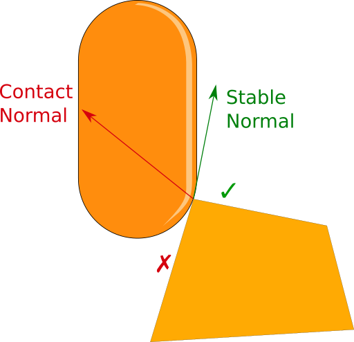

# States

This character controller state can be defined at any time as a mix between two very important properties:

* Ground state (grounded, not grounded).
* Stability (stable, unstable).

## Grounded state

This property indicates if there is ground below the character, simple as that. This property alone does not influence the actor internal logic at all, that's something the stability does.

The main property associated with the grounded state is the **IsGrounded** public property. There are much more properties associated with the current ground (see the API reference for more info).


Due to how the character projects its own velocity, **it is not possible to leave the grounded state by applying a vertical velocity**.


## Stability

The internal logic of the character controller works differently depending on the current stability state. That is, if the character is stable then it uses most of the features from the controller (velocity projection, step up, step down, edge compensation, and so on). If it is not, then most of the features are disabled.

.png>)

A character is _**stable**_ when it is grounded and the _**stable slope angle**_ (see the API reference) is less than or equal to the _**slope limit**_ value.

```csharp
IsStable = IsGrounded && ( stableSlopeAngle <= slopeLimit ); 
```

The stable slope angle is selected internally by the character actor based on a few conditions. For example, take a look at the following image:



There are two surfaces in which one of them is unstable (red) and the other one is stable (green).&#x20;

The stable normal is chosen as the one coming from the stable surface. This normal determines the movement displacement direction. On the other hand, the contact normal corresponds to the normal obtained by the physics query (e.g. CapsuleCast).

## States

Based on what has been said before, the character actor can be:

| CharacterActorState | IsStable | IsGrounded | Description                                                                                         |
| ------------------- | -------- | ---------- | --------------------------------------------------------------------------------------------------- |
| StableGrounded      | true     | true       | There is ground below the character and it is a stable surface. Most of the features are processed. |
| UnstableGrounded    | false    | true       | There is ground below the character, however, it is not a stable surface. Features are bypassed.    |
| NotGrounded         | false    | false      | Same as before, however there is no ground below.                                                   |

.png>)

Getting a particular state is equivalent to get the two properties separately. For example:

```csharp
//-----------------------------------------------------------------------------
// Using properties

if( CharacterActor.IsGrounded && !CharacterActor.IsStable)
{
    ProcessUnstableGroundedLogic();
}

// ----------------------------------------------------------------------------
// Using the CharacterActor state

if( CharacterActor.CurrentState == CharacterActorState.UnstableGrounded )
{
    ProcessUnstableGroundedLogic();
}
```

