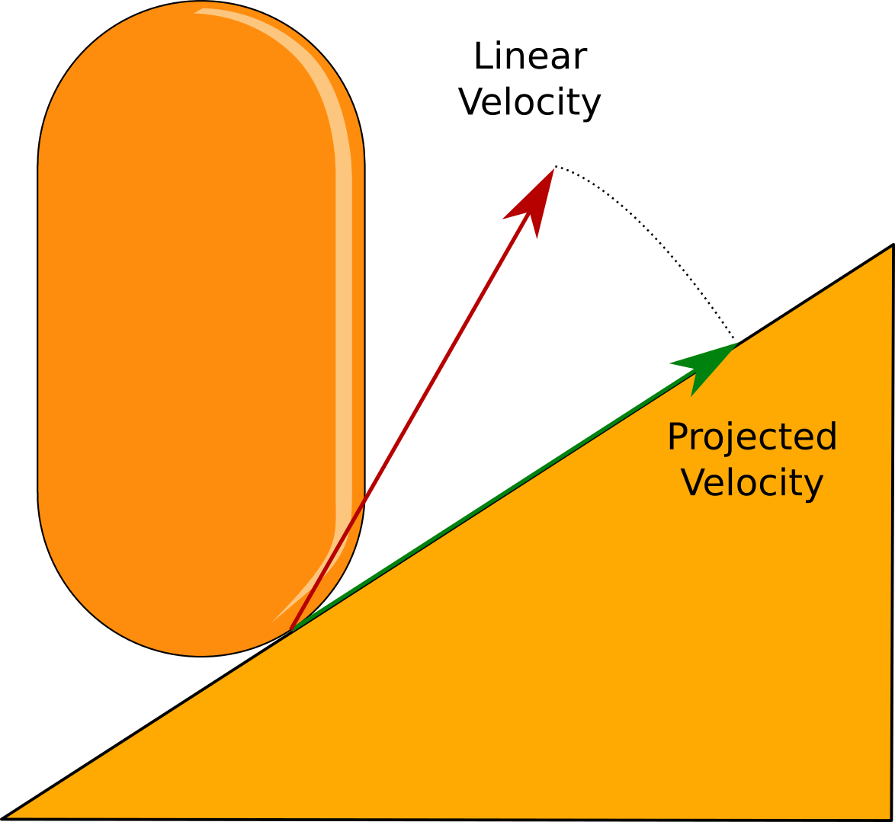
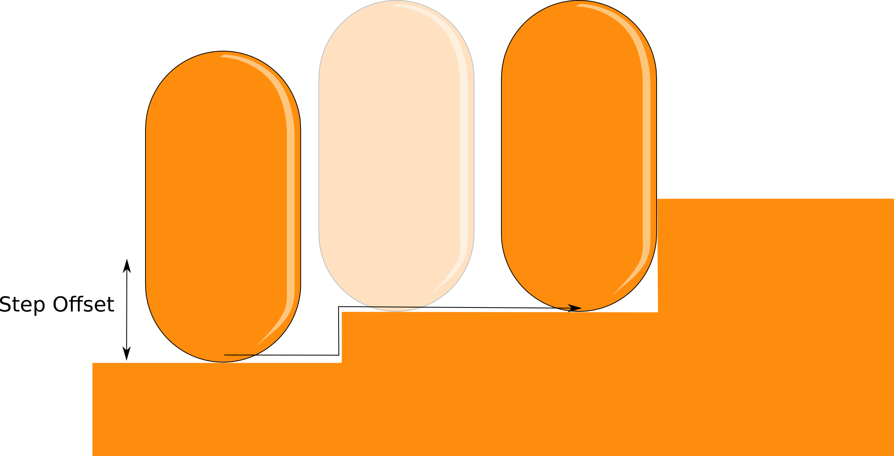
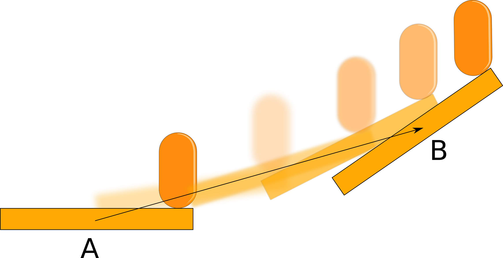

# Stable movement features

These features from the CharacterActor component \(as seen in the previous section\) **will be applied only if the character is stable**.

## Movement

### Velocy projection

Internally, when the character is stable, the CharacterActor component will project the input velocity \(Linear Velocity\) onto the current ground surface \(Projected Velocity\).

This process will always maintain the initial velocity magnitude, regardless of the slope angle.

### Collide and Slide

This algorithm is responsible for determining obstacles along the way. If the encountered surface is allowed the character will walk onto it \(maintaining always the displacement magnitude\). if not, the slope will be considered as an invisible wall.

  ​

## Grounding

### Step up/down

This feature is responsible for putting the character on the ground \(if there is one\). There are two important values to consider:

* **Step up distance:** Any stable surface below this height will be walkable by the character.
* **Step down distance:** When losing contact with the ground, if the distance between the character and the ground is less or equal to this value, then the character will be automatically _grounded_ \(sticking to the ground\)_._ If there is no ground at all, then the character will be _not grounded_.

### Edge Compensation

Normally, when a character is standing **on an edge** it collision shape will make contact with it. What edge compensation does is to lift up the capsule, simulating a cylinder shape. 

     

This feature only works on edges, for slopes you will get the same results as before \(with edge compensation disabled\).

### Dynamic Ground

If the character is standing on a **valid dynamic ground**, and this object is moved and/or rotated, then the character will move and/or rotate along with it \(the up direction will always be maintained\). 

A valid ground can be a:

* RigidbodyComponent ground.
* Vanilla rigidbodies \(regular Rigidbody/Rigidbody2D components without RigidbodyComponent\).

For more information about what a valid dynamic ground please check the supportDynamicGround field and its related tooltips.

## Rigidbody interactions

### Weight

If the character is standing on top of a dynamic rigidbody this will automatically apply a force to it at the contact point, proportional to the rigidbody mass.

### Push

The character can push other dynamic rigidbodies by colliding with them. It is also possible to ignore some rigidbodies by using a dedicated layermask:

