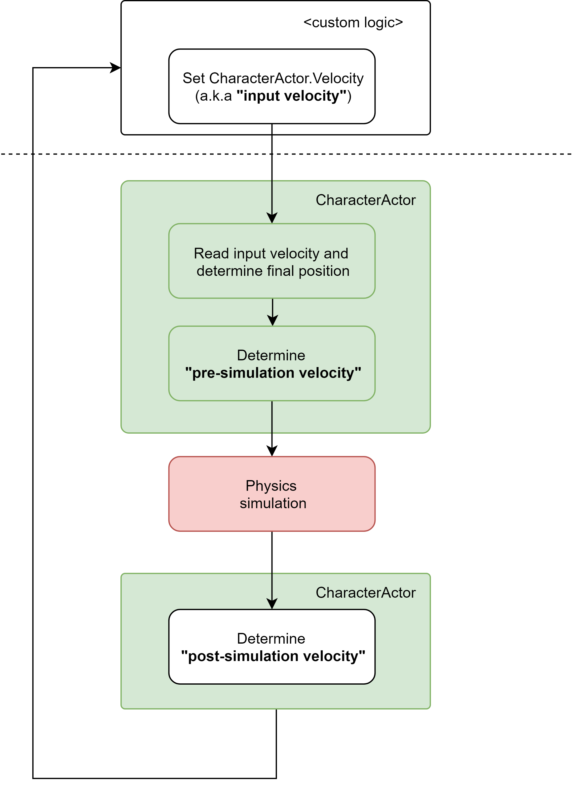

# Velocity

This section explains how is the entire process behind the velocity calculation, from the beginning of the cycle until the end \(after the simulation\).

The CharacterActor component handles three important velocity values during each cycle \(FixedUpdate\):

<table>
  <thead>
    <tr>
      <th style="text-align:left">Velocity</th>
      <th style="text-align:left">Description</th>
    </tr>
  </thead>
  <tbody>
    <tr>
      <td style="text-align:left">
        <p></p>
        <p>Input velocity</p>
      </td>
      <td style="text-align:left">This vector is read by the CharacterActor component in order to move from
        point A to point B.</td>
    </tr>
    <tr>
      <td style="text-align:left">
        <p></p>
        <p>Pre simulation velocity</p>
      </td>
      <td style="text-align:left">Determining the final position might require the input velocity to change.
        This value is feed to the physics simulation.</td>
    </tr>
    <tr>
      <td style="text-align:left">
        <p></p>
        <p>Post simulation velocity</p>
      </td>
      <td style="text-align:left">After the simulation is done, the velocity might change once again.</td>
    </tr>
  </tbody>
</table>



## Input velocity

This vector is effectively the rigidbody velocity prior to the FixedUpdate call. It is called "Input" velocity since this is the value chosen by the user \(gameplay logic\).

In order to set up this value you just need to modify the CharacterActor velocity:

```csharp
CharacterActor.Velocity = someValue;
```

## Pre-simulation velocity

Technically speaking, this is the velocity created internally by the CharacterActor component, necessary to determinte the final destination of the character. This value is then fed to the physics simulation \(hence the name\).

## Post-simulation velocity

After the simulation is done, the post-simulation velocity is the resulting velocity of the rigidbody. Pre-simulation velocity and post-simulation velocity might be different, especially if the character collided with another rigidbody.


The CharacterActor component allows you to choose which one of the three velocities mentioned before you want to re-assign as post-simulation velocity.


