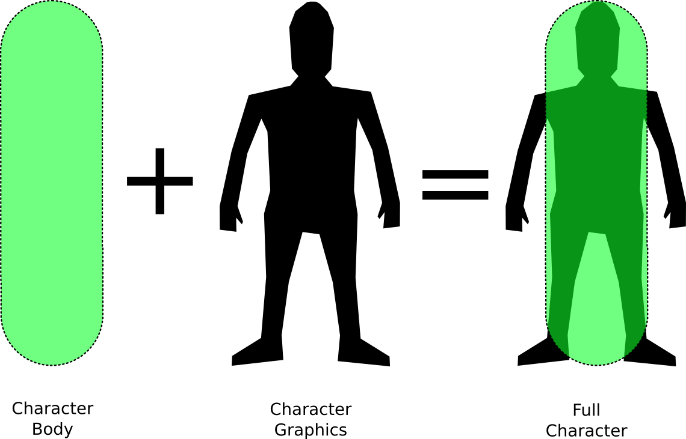

# Character graphics

Any character in a real-game scenario can be separated into two parts, a physics component and a graphics component, both working together to produce the result we want. The physics component is referred as the _Character Body_ \(or simply the "character''\), and the graphics component as the _Character Graphics_.

|  |  |
| :--- | :--- |
| Character body | This is the actual \`\`character'', it does calculate everything in order to detect collisions, set flags, trigger collision events, and so on. This object is the one with the _CharacterBody_ component in it. |
| Character graphics | It corresponds to what you actually see on the screen. It includes all the extra components that don't relate directly to the collision body, things like renderers, animations, particles effects, etc. This object is the one with the _CharacterGraphics_ component in it. |

Decoupling the graphics from the collision body can be very advantageous, since we can handle the position and rotation independently from the character object. For instance we can produce any rotation we want \(a common example is the smoothed yaw motion\).

The _CharacterGraphics_ component is assigned to a _graphics object_ \(hence its name\), taking care of its transform properties, such as position, rotation and scale changes. If you notice the _CharacterGraphics_ does not do any graphics related tasks, such as managing animations, renderering, shaders, etc. Instead **it is used to define what is graphics inside the character hierarchy**. This means that the _graphics object_ doesn't have to necessarily include all the graphics components directly in it \(for instance these elements can be added to its children\).


Think of the _graphics object_ as the root of every graphics related object of your character.


The _graphics object_ is treated as a separated object from the character. Once the game is running \(play mode\), the graphics object and the character object will be separated from each other.

