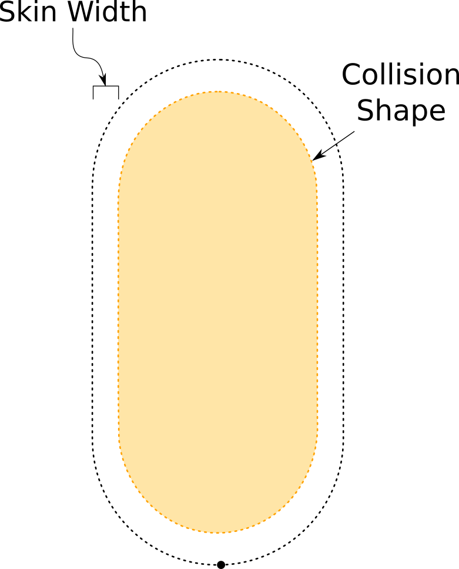

# Character body

## Components required

The character uses a 2D/3D _Rigidbody_ and a 2D/3D _CapsuleCollider_ in order to detect collision, generate contacts, do movement, etc. Since the 2D and 3D world have their own specific components, a single component has been created in order to encapsulate both the _Rigidbody_ and the _Collider_, thus creating a level of abstraction.

## Properties

### Foot position

The foot position is considered as the origin, a point of reference for everything. As is normally for character controllers, the origin is assumed to be the bottom most point of the character body. In this case is the bottom point of the capsule.

### Orientation

The character is modeled as an upright capsule. This means that the capsule height vector\footnote{Vector defined from the bottom sphere to the top sphere} and the up vector of the character transform will have always the same direction vector.

This capsule is not visible, any real character will need a graphics element with a renderer to show the mesh or sprite on screen.

### Size

Since this is a capsule-based character we need only to define the radius and the height to fully describe the size of the character. The \textit{CharacterActor} will consider the character dimensions as:

$$
Width = 2 \times Collider.Radius
$$

$$
Height = Collider.Height
$$

The Width and Height values are represented with the _body size_ \(a _Vector2_\).


In play mode the collider offset will be automatically adjusted.


### Scale

This is an important topic, the \textit{CharacterBody} component defines the character size using an absolute value based on a _Vector2_ field. The _CharacterActor_ component reads this value in order to perform all the necessary physics queries \(mainly for collision detection\).

#### So, What happens if the _localScale_ is not _Vector3.one_? 

Even though the collider will be scaled just fine, the internal "physics size'' will not. So, **it is not recommend to scale the character using the** _**Transform**_ **component**.

#### What if i want to scale my character?

Well, in that case you should scale the graphics object, not the character itself. After that, the body size should be modified to fit the graphics.


The character _localScale_ should always be $$< 1, 1 , 1 >$$.


### Collision shape

Even though this is a dynamic character controller, the \textit{CharacterActor} is still doing physics queries to detect collisions. Because of this an effective collision shape was defined \(different from the character body shape\) using the width, height and skin width \(See figure \ref{fig:Tuto\_character\_SW}\).

