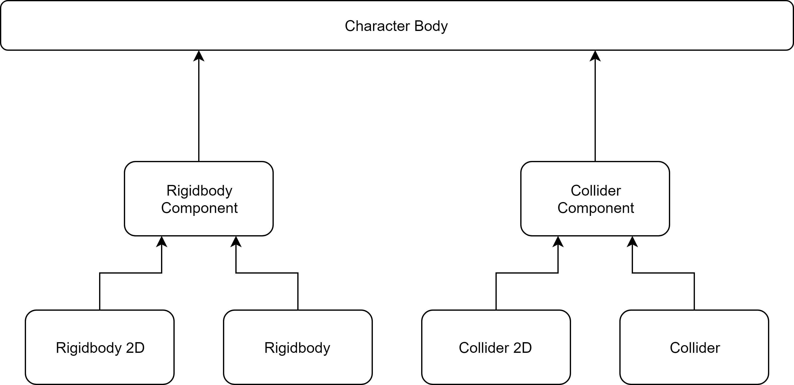

# Components

The character uses a 2D/3D _Rigidbody_ and a 2D/3D _CapsuleCollider_ in order to detect collision, generate contacts, do movement, etc. Since the 2D and 3D world have their own specific components, a single component has been created in order to encapsulate both the _Rigidbody_ and the _Collider_, thus creating a level of abstraction.

