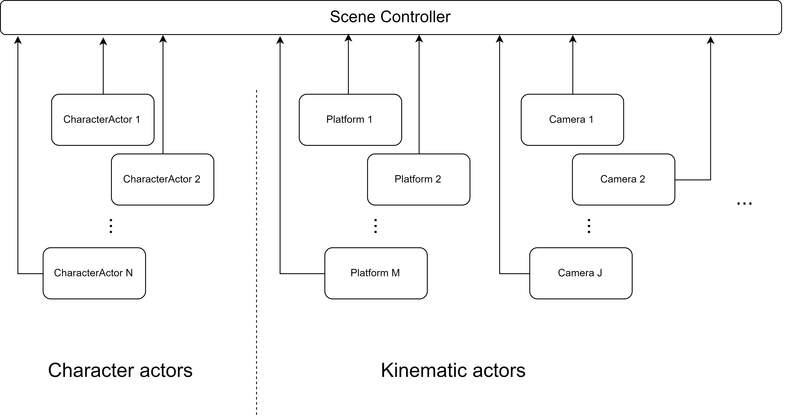

# Update process

The whole update process can be explain using the _Scene_ concept. 

A **scene** consist of **actors** moving around and interacting with each other. In this case there are two types of actors: characters and kinematic actors.

|  |  |
| :--- | :--- |
| Character Actor | It represents a **character**. This is the main component of any character in the scene. |
| Kinematic Actor | It represents a **kinematic rigidbody**. This can be used to represent more than one type of kinematic rigidbodies, such as moving/rotating platforms, a camera, or anything else. |

### Scene Controller

A _scene controller_ is responsible for updating the position and rotation of all the actors in the scene. It is responsible for guaranteeing a nice interpolated movement, especially for characters affected by dynamic platforms.

A way to control the interpolation process is required because of the way that _MovePosition_ and _MoveRotation_ work \(For more information about these methods check the [Unity's scripting reference](https://docs.unity3d.com/ScriptReference/Rigidbody2D.MovePosition.html)\).


It is mandatory for the SceneController to be present in the scene, otherwise the characters and the kinematic actors won't update. 

You don't need to add manually this component to the scene. If there is a character actor in the scene, this component will be instantiated automatically.


The scene controller updates all the actors in the correct order. After the update process has finished, the interpolation process begins.

