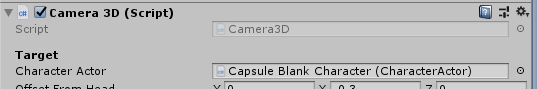

# Get started \(really quickly\)

This section is not intended as an "official" tutorial. For more detailed information please read the fundamentals \(just to grasp how everything works\) and then the tutorials \(to implement some of those concepts\).

I will assume you have already set the project properly. If not, please go to the [setting up the project](../package/setting-up-the-project.md) section.

Without further ado, let's get started.

## Setting up a 3D character

First and foremost, in order to follow the next steps, it's recommended to start fresh. Open the **"Minimal Scene \(Get Started\)"** scene.

Summary:

1. Add the **character prefab.**
2. Choose the **"tags and layers"** profile.
3. Add the **"CharacterStateController".**
4. Add the **"NormalMovement"** state**.**
5. Choose a **"materials properties"** asset.
6. Add the **input data** asset.
7. Add the **camera**.
8. Select the **camera target**.
9. Set the **movement reference**.

### 1. Add the character

Drag and drop the prefab **"Capsule Blank Character"** \(_Character Controller Pro/Core/Prefabs_\) into the scene. This is the same as the Blank Character, but with graphics \(a capsule + an arrow above of the "head"\). It also includes the most basic components, such as _CharacterBody_ and _CharacterActor_.

### 2. Choose the "tags and layers" profile

Go to the root object \(the _character_\), _CharacterActor_ component, and choose an asset for the field **"tags and layers profile"**:

Select the default one that comes with the package \(it's fine\).

### 3. Add the "CharacterStateController"

Add this component to the root object \(_character_\). This will also add a _CharacterBrain_ component.

\(Now you are in "Implementation" territory\)

### 4. Add the "NormalMovement" **state**

The _CharacterStateController_ component requires a "current state". Add the _NormalMovement_ state component to the character \(all states need to be added in a similar way\). 

Then drag the new component to the "current state" field.

### 5. Choose a "materials properties" asset

In the _CharacterStateController_ component, select the default _material properties_ asset.

### 6. Add the input data asset

Without inputs actions nothing is going to happen. Go to the CharacterBrain component and add the default input data asset available in the project.

Now you should be able to move the character around. Nothing is configured in detail yet, you will need to do that in your own time.

Next, we need to add the camera.

### 7. Adding the camera

Drag and drop the "Camera3D" prefab into the scene. It doesn't matter where exactly, the position and rotation will be handled by the camera.

\(Another quick way is to just add the "Camera3D" component to a new Camera game object\)

### 8. Select the camera target

Go to the Camera3D component and assign the character actor field with the CharacterActor component from the character.

Now you should be able to move the camera around the player, detecting collisions with the environment. 

### 9. Set the movement reference

The camera is doing its work, but still, the player is not moving using the camera as the movement reference \(as shown in the 3D demo scene\). In order to fix this, go to the _CharacterStateController_ component, select the "movement reference" mode to External. Then choose the camera as the external forward reference.

## Setting up a 2D character

Let's make a parallel version of the previous instructions, but this time for 2D. In the following list are some of the changes you will have to take care of, in order to bring to life a fully functional 2D character.

* Go to the _CharacterBody_ component and select "2D":

* Do the same from instruction 1 to 6.
* For the camera, drag and drop the "Camera 2D" prefab into the scene and select the character as its target.

That's it! 😅

Please note that even though this is really easy, i'm not considering the graphics and animation of the character at all. Please refer to the tutorials sections for those subjects.

## 

