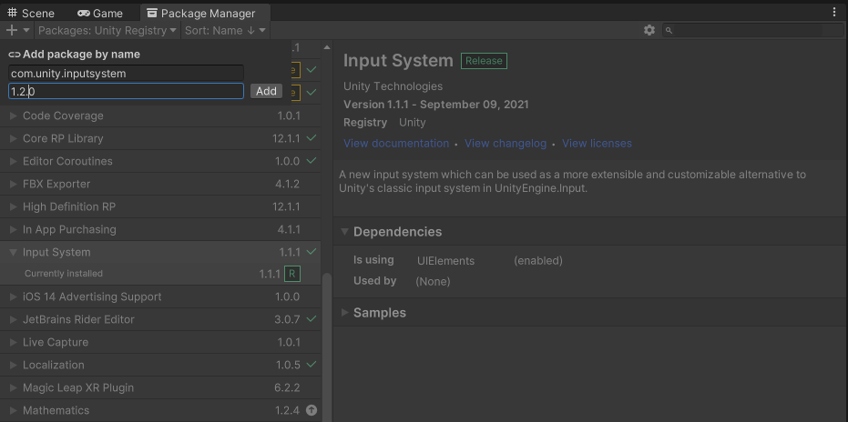

# Known issues

Sometimes, a new editor release (or even a package release) could introduce some bugs into your project without warning. It is normal for the user to get confused and frustrated by this and assume that the asset is the one causing trouble.  This section has been created in order to expose all these issues one by one.

## Unity's new input system doesn't work

#### Description

Some actions are not updated properly, especially the "Movement" action, even when everything has been set up correctly. For instance, the character from the demo won't be able to move, this is because the ReadValue method isn't working properly, which affects Vector2 actions and float actions.

#### Unity version

2021.x.y

This problem is caused by the input system package itself. That being said, you will probably experience this issue if you are using Unity 2021.x.y. This is because this version of the editor does not expose version 1.2.0 of the input system. This should not happen with 2019.x.y and 2020.x.y.&#x20;

#### Input system version

1.1.1

#### Fix

Update your input system package to version 1.2.0 or higher.&#x20;

For more information please check the [changelog entry](https://docs.unity3d.com/Packages/com.unity.inputsystem@1.2/changelog/CHANGELOG.html#fixed).&#x20;

> _Fixed `action.ReadValue` and others returning invalid data when used from `FixedUpdate` or early update when running in play mode in the editor (_[_case 1368559_](https://issuetracker.unity3d.com/issues/enter-key-is-not-registered-when-using-waspressedthisframe-with-input-system-1-dot-1-1) [_case 1367556_](https://issuetracker.unity3d.com/issues/input-action-readvalue-always-returns-zero-when-called-from-fixedupdate) [_case 1372830_](https://issuetracker.unity3d.com/issues/querying-inputs-before-preupdate-dot-newinputupdate-returns-invalid-data-when-running-in-play-mode-in-editor)_)._

If this version is not available for you, try the following:

1. Open the package manager.
2. Go to "Unity registry".
3. Click the "+" icon, then "Add package by name".
4. Type _**com.unity.inputsystem**_
5. Then type version _**1.2.0**_ (although this is optional, the latest version will be added)
6. Restart the editor (very important).

## Invisible animation state inspector

#### Description

The state (mecanim) inspector doesn't show up when you click over the state.

#### Unity version

2020.1.x

#### Fix

Follow this [link ](https://answers.unity.com/questions/1736606/animation-state-of-controller-not-showing-in-inspe.html?childToView=1737595#answer-1737595)instructions.

[Issue tracker link](https://issuetracker.unity3d.com/issues/inspector-not-displaying-state-and-transition-properties-once-duplicated)

## Animation being ignored

#### Description

The Animator does not recognize the NormalMovement runtime animation controller (by default) even though it has been set up correctly. This may happen the **first time** the asset is imported.

#### Unity version

2020.x.y

#### Fix

Restart the project.

