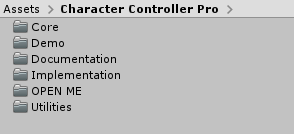

# Setting up the project

### Importing the package

Hit the import button! Once the package has been imported your project view should look like this:

The first thing to do is to open the folder _OPEN ME_. In there you will find all the necessary material to put this package to work.


The demo scenes work with some predefined project settings. It's important to configure your project with these **exact** settings.


Luckily for you there are presets included in the package that will help you to configure your project. These settings are related to _Layers_ , _Tags_ and _Inputs_. 

For example, for the Input settings, go to the InputManager:

Then select the preset, double click it:

 That's it!


Even though this need to be done in order to play the demo scenes, most of these settings are not mandatory for the normal operation of this package. They were built based on the demo assets.


