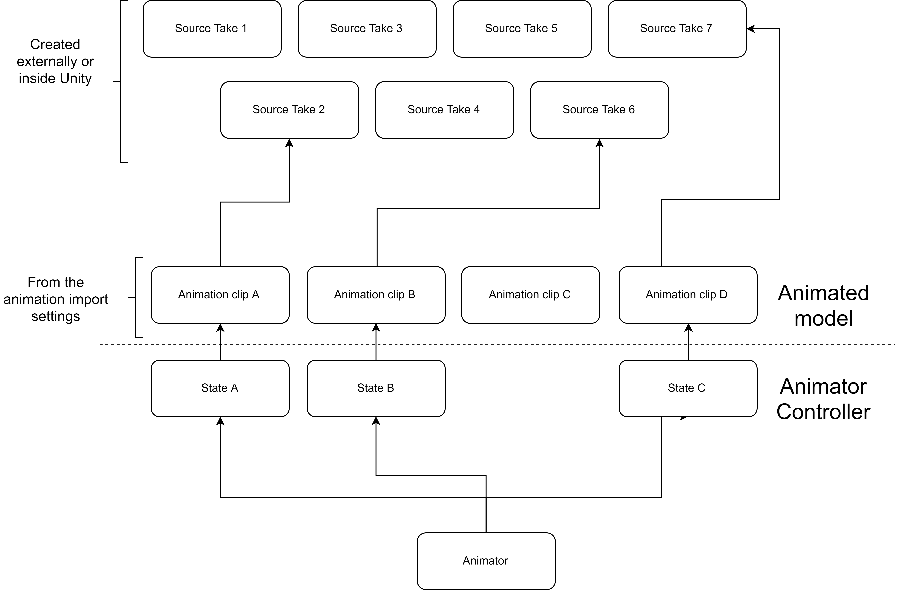

# Animator

## The animator controller

By getting the Animator controller into the mix we can expect a scenario like the one represented by the next figure:

## Internal structure

By default the _CharacterAnimation_ component is going to "expect" a layout pretty similar to the _Demo Character Animator Controller_ layout \(with or without transitions, depending on the chosen _animator play mode_\):

Now, we could create a new Animator controller a imitate all of its properties by creating all the states, transitions, variables, etc. However, **it would be very convenient for us to just duplicate the** _**Demo Character Animator Controller**_ 😉_**.**_ 


 If you are going to clone an asset from the package please put it outside the _Character Controller Pro_ folder.


This is useful because we have everything already defined 😀. Just drag the cloned animator controller into the controller field of the _Animator_ component.

## Custom data

Now it is a good time to assign your own clips if you want \(don't worry, you can still do this at any time\). For this you just need to go inside each of the states \(double-click\) and replace every clip with your own. The same goes to the rest of the settings, every property can be modified \(names, thresholds, etc\). Just remember to indicate the proper names in the _CharacterAnimation_ component.

One very important thing to note is the clips speed. By default every clip of _Demo Character_ have its own speed.

Just remember to modify this value to your liking.

