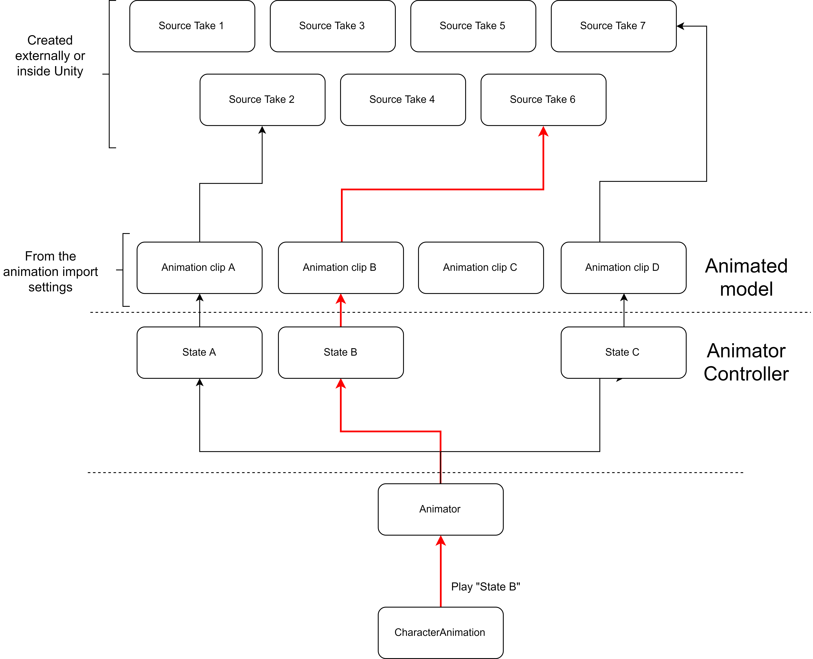

# CharacterAnimation

Last, we need to include the most important component the _CharacterAnimation_ component.

Add the _CharacterAnimation_ component to the object that contains the Animator, that is, the _Demo Character_ game object.

 The next thing to do is to set the variable and states names. Remember, these must match with the specified names in the _Animator_ controller.

Just for the sake of comparison, let's suppose the _CharacterAnimation_ component needs to play the "State B" state using the animator controller:

