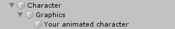

# Hierarchy

Referring back to the [Character graphics](../../../fundamentals/untitled/character-graphics.md) section, this is the recommended hierarchy structure for any CCP character:

By looking at the _Capsule Blank Character_, we can see the following hierarchy:

The _Graphics_ has the CharacterGraphics component \(as it should, because this will be the root of every graphics related content\). Then we have the _Capsule_ object with its child, both of these represents the Capsule mesh and the arrow mesh on top.

Since we aren't gonna need these objects anymore we can delete them.

Finally, just drag the _Demo Character_ model \(in your case your custom model\) into the _Graphics_ object

The hierarchy part is done. Notice that the Animator component has been added to the _Demo Character_ game object \(this is because of the Rig settings\).


This may sound a little obvious, remember to modify the body size \(_CharacterBody_\) until the body fits exactly like you want with the mesh. You can do this at any time.


