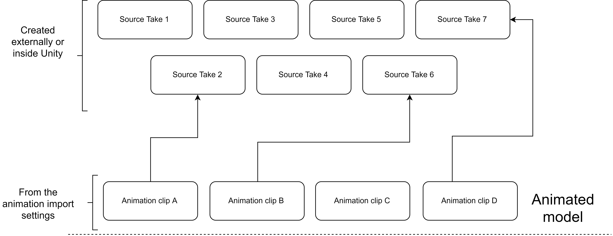

# Rig and Animation settings

The following sections are not entirely related to CCP. I will explain some basics of import settings, rigs and animations. If you consider yourself an intermediate/expert on this topic you can ignore the following. If not, please keep reading. 

## The model


The state of the model you are going to use is very important, make sure everything is well organized and designed before importing it to Unity. One clear example of this: if you want to use IK foot placement \(included in the package\) you will need to configure a humanoid rig, which requires a proper bones hierarchy \(hips -&gt; leg -&gt; foot etc\).


These are the basics import sections:

We are going to focus at the Rig and the Animation settings.

## Rig settings

The rig is very important, basically it defines the type of the animation as a whole. Just as a quick cheat sheet:

|  |  |
| :--- | :--- |
| None | No animation |
| Legacy | _Animation_ component  |
| **Generic** | _**Animator**_ ****component \(root motion\) |
| **Humanoid** | _**Animator**_ ****component \(root motion + IK\) |

So, based on this you can select the type you want. In this scenario we are going to need to interact with an Animator component, so let's ignore None and Legacy.


If you need to use IK foot placement for your character select the _Humanoid_ type and configure the _Avatar_.


## Animation settings

An _Animator_ state contains a clip, basically, however these are not automagically asigned for us, we have to do it ourself. The next diagram represents a generic animated model with clips + source takes:


As you can see, the model can have many takes and/or animation clips, it really doesn't matter at all. **What matters is the assignment of those clips with the right state. This is done within the Animator controller environment.**


The _Demo Character_ model was created 100% in Blender \(3D model + all the animations\). Let's take a look at its animation setting, these are all the available "clips":

Each one of these contains a particular "source take". For example:

## 

