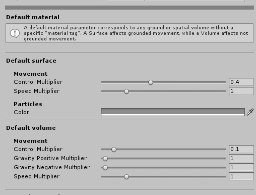

# Creating a state

If you want to extend the current implementation, probably the first thing you want to do is to create your own state. So, let's forget about the _NormalMovement_ state and let's create our own.

There are two important thing to consider in order to achieve a successful state creation

1. The creation and implementation of the state. In other words, writting the code 🙂 .
2. The integration with other states \(optional\). This refers to the implementation of the "transition code" for any related state.


Without the integration with other states it is not possible to transition to the new state \(unless the state controller uses the new state as the starting state\).



## Manually

Since this is a state we must derive from the _CharacterState_ class, implementing its abstract and virtual methods to define the behaviour we want \(the same way you implement Unity's messages, like Start, Update, FixedUpdate, etc\).

This can be achieve by creating the state like this:

```csharp
using UnityEngine;
using Lightbug.CharacterControllerPro.Implementation;


public class BasicState : CharacterState
{

}
```

Notice that we need to use the `Lightbug.CharacterControllerPro.Implementation` namespace in order to use the _CharacterState_ component.

You will also notice that two errors appear. This is because **the CharacterState component is abstract**. All derived classes must implement all its abstract methods and properties. 

In this case, there is an `UpdateBehaviour` abstract method and a `Name` abstract property \(getter\). If we implement those we get the following:

```csharp
using UnityEngine;
using Lightbug.CharacterControllerPro.Implementation;


public class BasicState : CharacterState
{
    public override string Name
    {
        get
        {
            return "BasicState";
        }
    }
    
    
    public override void UpdateBehaviour( float dt )
    {
    
    }
}
```

The `Name`property is needed to register this state inside the state controller. This is useful when we need to get a particular state, especially when implementing the transitions.

Now you can start to write your own state logic.

Although this code is super simple to write, there is an easier way to create a state by using the "Create" menu.

## Using the "Create" menu

You can use the "Create" menu, just as you created C\# scripts. Right mouse click on the project view, _"Create/CharacterControllerPro/Implementation/CharacterState"_.


A small window will pop up. Write the state name and click "Create":



There you have it! By default a new C\# script will be created with something like this inside:

```csharp
using System.Collections;
using System.Collections.Generic;
using UnityEngine;
using Lightbug.CharacterControllerPro.Implementation;


public class BasicState : CharacterState
{

    // Write the name of your state here (returned string)
    public override string Name
    {
        get
        {
            return "BasicState";
        }
    }

    // Write your initialization code here
    protected override void Awake()
    {
        base.Awake();
    }

    // Write your transitions here
    public override CharacterState CheckExitTransition()
    {
        return null;
    }

    // Write your transitions here
    public override bool CheckEnterTransition( CharacterState fromState )
    {
        return true;
    }

    // Write your update code here
    public override void UpdateBehaviour( float dt )
    {
        
    }

    // Describe your state here
    public override string GetInfo()
    {
		    return "Describe your state here!";
    }

}
```

